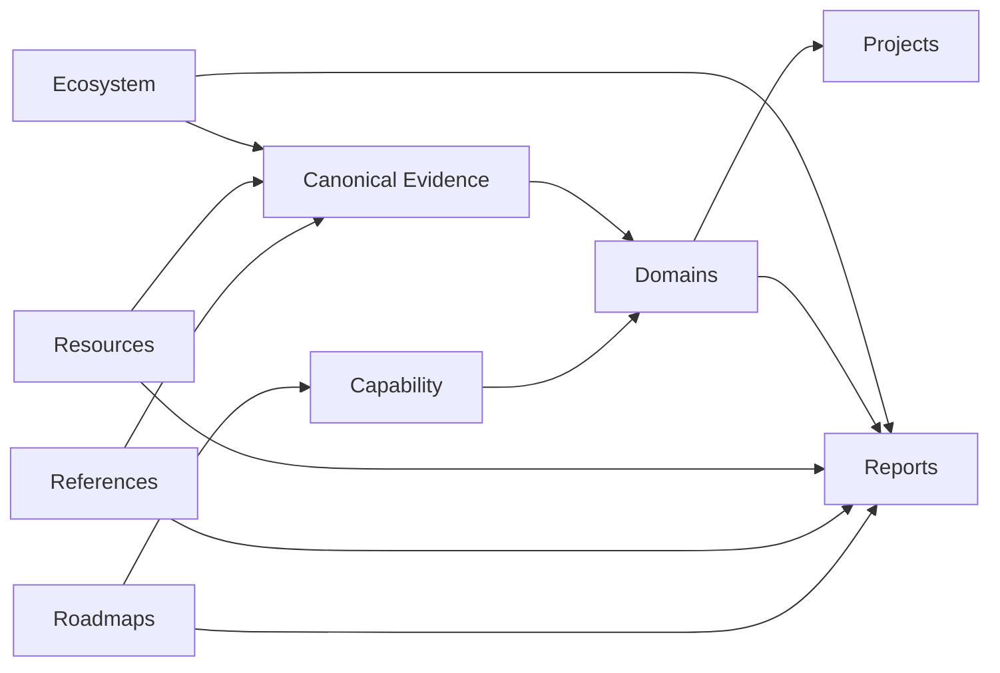

# Architecture

> How Materials Atlas turns curated material into navigable knowledge.

## Purpose

Materials Atlas separates learning, stable explanation, external evidence, synthesis, and repository health so that each can evolve without duplicating the others.

This document explains the system. It does not set editorial quality rules; see [EDITORIAL.md](EDITORIAL.md). It does not define scientific boundaries; see [SCIENTIFIC_SCOPE.md](SCIENTIFIC_SCOPE.md).

## Repository Layers

| Layer | Responsibility |
|-------|----------------|
| `roadmaps/` | Teaches sequence and capability through learning modules. |
| `references/` | Defines canonical explanations, terminology, and diagram collections. |
| `resources/` | Curates external books, papers, software, datasets, and videos. |
| `domains/` | Synthesizes mature evidence around a field-level question. |
| `ecosystem/` | Maps people, institutions, and infrastructure in context. |
| `projects/` | Reserved for concrete reproducible projects when they exist; it is intentionally absent today. |
| `reports/` | Contains generated repository health and progress views. |

## Knowledge Flow

Roadmaps answer what to learn next. References answer what a stable concept means. Resources and ecosystem indexes provide curated context. Domains connect those layers when the evidence is mature enough. Projects, once present, turn domain understanding into reproducible work. Reports describe repository state rather than scientific claims.

## Ownership Rules

- A concept is explained once in `references/` when it needs a stable canonical definition.
- A learning sequence belongs in `roadmaps/`, even when it links to references and resources.
- An external work is curated in `resources/`; its context may be synthesized in a domain.
- A person or institution belongs in `ecosystem/` only when it clarifies influence or infrastructure.
- A domain does not copy entire references or indexes. It explains why their relationship matters.
- A report is generated from repository metadata and is never a manual source of truth.

## Architecture Changes

Structural changes are exceptional. Add a layer, directory, or automation only when it creates a durable ownership boundary or removes recurring manual maintenance.

Use [CONSTITUTION.md](CONSTITUTION.md) to evaluate the proposal, [EDITORIAL.md](EDITORIAL.md) to evaluate content quality, and [domains/README.md](domains/README.md) to evaluate domain readiness.
