# Mermaid Style Guide

> Visual language for Materials Atlas.

---

# Purpose

Mermaid diagrams are not decoration.

They are visual mental models.

Every diagram should reduce cognitive load, reveal relationships, or explain a concept more effectively than prose alone.

If a diagram does not improve understanding, remove it.

---

# Design Principles

Every diagram should be:

- Concept-first
- Minimal
- Reusable
- Self-contained
- Consistent

Prefer several focused diagrams over one large diagram.

One diagram should answer one question.

---

# The One Question Rule

Before drawing a diagram, write the question it answers.

Examples:

- How does processing influence performance?
- Which computational method operates at this scale?
- What are the prerequisites for DFT?
- How do crystal defects relate to material properties?

If you cannot express the question in one sentence, split the diagram.

---

# Diagram Grammar

Every diagram should represent exactly one of these:

- Process
- Hierarchy
- Relationship
- Timeline
- Software Architecture
- Summary

Do not mix grammars.

---

# Preferred Diagram Types

## Process

Use:

`flowchart LR`

For:

- workflows
- causal chains
- learning sequences
- computational pipelines

Example:

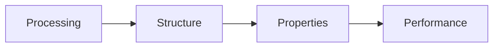

---

## Hierarchy

Use:

`flowchart TD`

For:

- abstraction levels
- length scales
- dependency trees
- taxonomies

Example:

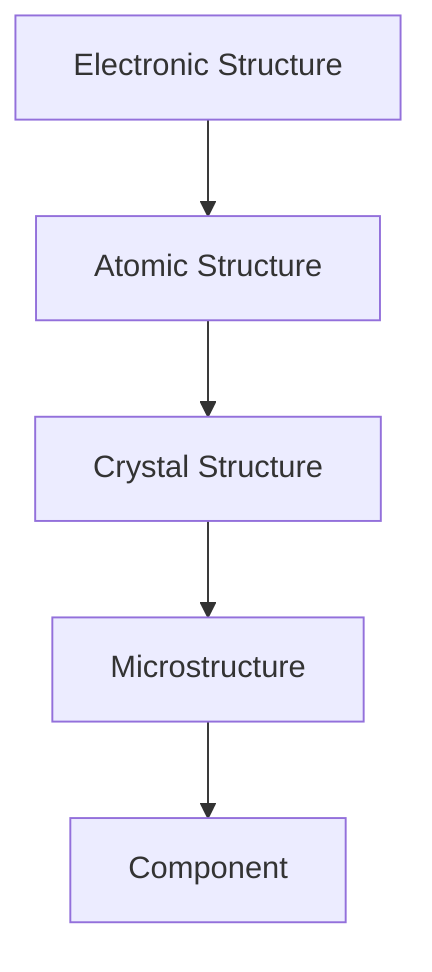

---

## Relationships

Use:

`graph TD`

For conceptual relationships.

Do **not** use it for workflows.

Example:

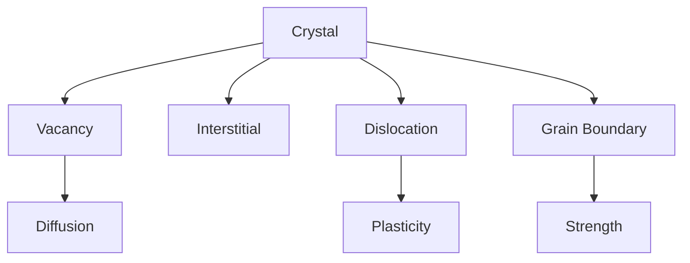

---

## Timeline

Use:

`gitGraph`

Only for historical evolution.

Example:

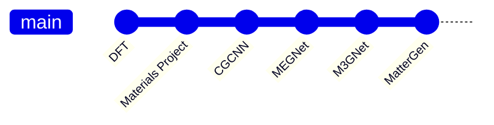

---

## Software Architecture

Use:

`classDiagram`

Only for software systems.

Example:

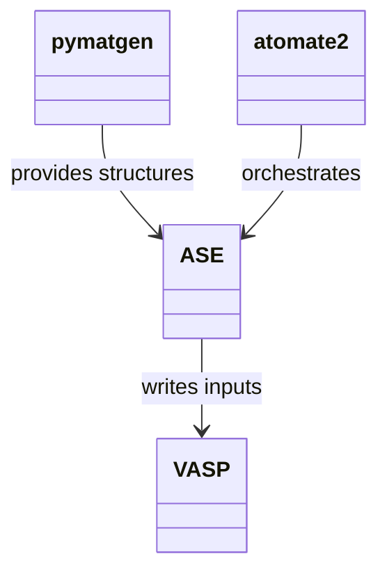

Do not use class diagrams for scientific concepts.

---

## Mind Maps

Use:

`mindmap`

Only for module summaries.

Maximum one per module.

Example:

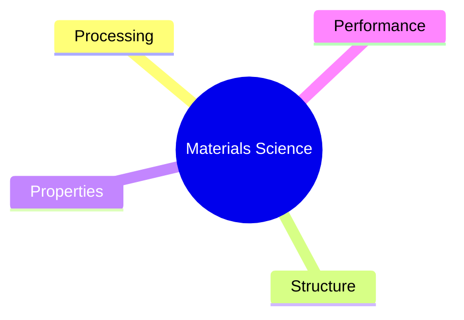

---

# Direction

## Left → Right

Use for:

- processes
- workflows
- computational pipelines
- learning paths

---

## Top → Bottom

Use for:

- hierarchies
- taxonomies
- dependency trees
- length scales

---

# Node Style

Always define explicit node identifiers.

Good:

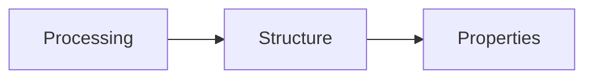

Avoid:


Identifiers simplify future edits.

---

# Node Labels

Keep labels concise.

Good:

```
Crystal Structure
```

Avoid:

```
Crystal Structure Determines Mechanical Properties
```

Long explanations belong in the surrounding text.

---

# Relationships

Prefer simple arrows.

```
A --> B
```

Avoid unnecessary edge labels.

Instead of:

```
A -->|causes| B
```

prefer:

```
A --> B
```

Explain the relationship in prose.

---

# Complexity Budget

Aim for:

- one concept
- one page
- fewer than ten nodes

Split diagrams before they become difficult to read.

---

# Canonical Diagram Library

These diagrams should remain visually consistent across the Atlas.

---

## Processing → Structure → Properties → Performance


---

## Structural Hierarchy

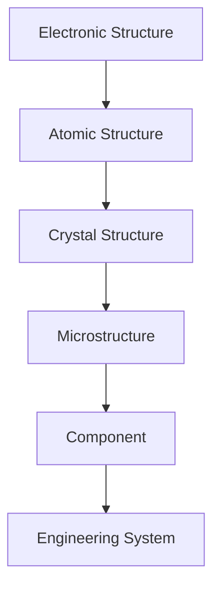

---

## Computational Materials Landscape

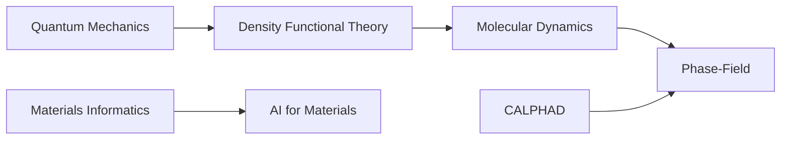

---

## Scientific Workflow

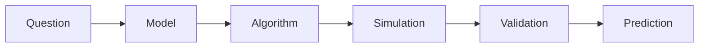

---

## Learning Workflow


---

## Research Lifecycle

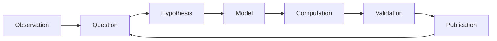

---

# Module Requirements

Every learning module should include:

- one Process diagram
- one Hierarchy diagram
- one Relationship diagram

Optional:

- Timeline
- Software Architecture
- Mind Map

---

# Anti-Patterns

Do not:

- repeat bullet lists as diagrams
- create decorative diagrams
- place paragraphs inside nodes
- combine unrelated concepts
- create giant all-in-one diagrams

Large diagrams should be decomposed into focused diagrams.

---

# Relationship With The Atlas

Every Mermaid diagram should support one of:

- a roadmap
- a learning module
- a domain page
- a resource page
- a project

If it cannot be connected to one of these, it probably does not belong.

---

# Rendering Rule

Every Mermaid block in this repository must render successfully on GitHub.

Pseudo-code is not allowed.

Only include valid Mermaid syntax that has been verified to render correctly.

---

# Editorial Rule

Every diagram should satisfy this sentence:

> Without this diagram, the page would be harder to understand.

If that statement is not true, remove the diagram.