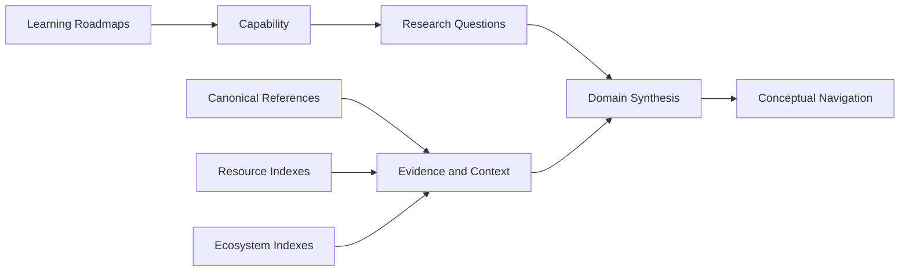
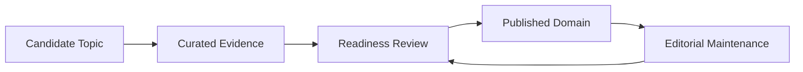

# Domains

> The highest synthesis layer of Materials Atlas.

## Purpose

Domains organize knowledge around the questions researchers and learners actually ask.

A reader usually begins with a field-level question:

- How do I understand Density Functional Theory?
- Which tools, data, and papers matter for Materials Informatics?
- How does CALPHAD connect to alloy design?
- What should I know before studying AI for Materials?

Those questions are domain-centered, not resource-type-centered.

A domain page is therefore a curated map of a durable area of Computational Materials Science or a closely connected field. It may describe a method, material class, modeling scale, discovery workflow, or scientific problem area.

Domains do not exist to collect links. They exist to explain relationships between concepts, methods, software, datasets, people, institutions, applications, and open problems.

## Knowledge Flow

Roadmaps build capability. Reference pages establish reusable explanations. Resource and ecosystem indexes provide evidence and context. A mature domain synthesizes those layers into a navigable field map.

The flow is intentionally one of synthesis rather than storage. A domain should point readers to the canonical explanation or external source instead of reproducing it.

## Domain Lifecycle

Domains emerge from mature understanding. They are never created as placeholders.

### Candidate Topic

A topic becomes a candidate when it recurs across roadmaps, references, resources, or ecosystem material and cannot be understood well through any one of those layers alone.

### Curated Evidence

The candidate accumulates enough existing material to support synthesis: stable concepts, a clear learning route, canonical resources, relevant software or datasets, and identifiable research context.

### Readiness Review

Before creating a page, confirm that the topic meets the readiness criteria below. If it does not, improve the underlying material first.

### Published Domain

Only a ready topic receives a page. The page starts from [TEMPLATE.md](TEMPLATE.md) and becomes the authoritative synthesis for that domain.

### Editorial Maintenance

Maintain a domain when new evidence changes its conceptual map. Merge, split, or retire a domain only when doing so makes the Atlas clearer and reduces duplication.

## Domain Readiness

Create a domain page only when all of the following are true:

- The scope can be defined in plain language and distinguished from nearby domains.
- The page can explain why the topic matters and which questions it helps answer.
- A learner can be given a defensible `Read After` route and a meaningful `Continue With` route.
- Existing canonical references, resources, software, data, people, or institutions provide enough material for synthesis.
- The page will reduce uncertainty beyond what the existing roadmap, reference, and resource pages already provide.

If a page would mainly contain placeholders, a list of links, or material copied from another section, it is not ready.

## Cross-Reference Policy

Each layer has one responsibility:

| Layer | Owns |
|-------|------|
| Roadmaps | Learning sequence and capability progression |
| References | Canonical explanations, notation, and reusable diagrams |
| Resources | Curated external books, papers, software, datasets, and videos |
| Ecosystem | People, institutions, and infrastructure context |
| Domains | The synthesis that connects those elements around a field-level question |

Domain pages should link to these canonical locations rather than duplicate them. A concise domain-specific explanation is appropriate when it establishes a relationship; a repeated standalone explanation is not.

Use the relationship vocabulary in [../EDITORIAL.md](../EDITORIAL.md): `Read after`, `Leads to`, `Related`, `Implemented by`, and `Maintained by`.

## Planned Domains

The following are likely future domains because they already recur across the Atlas:

- Density Functional Theory
- Molecular Dynamics
- CALPHAD
- Phase-Field Modeling
- Materials Informatics
- AI for Materials
- Scientific Computing
- Research Infrastructure

This is not a queue of placeholder pages. Each topic must independently satisfy the readiness criteria before a domain page is created.

## Relationship to the Template

[TEMPLATE.md](TEMPLATE.md) defines the internal structure of a published domain page.

This document defines whether a domain should exist, how it gains evidence, and how it relates to the rest of the repository. The template should be used only after the lifecycle reaches the published-domain stage.

## Editorial Standard

Domain inclusion is governed by [../EDITORIAL.md](../EDITORIAL.md).

Prefer one well-supported domain page over several shallow pages. If removing a proposed domain would not reduce understanding, do not create it.
