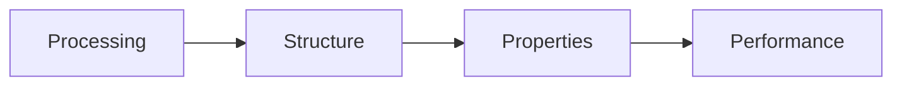
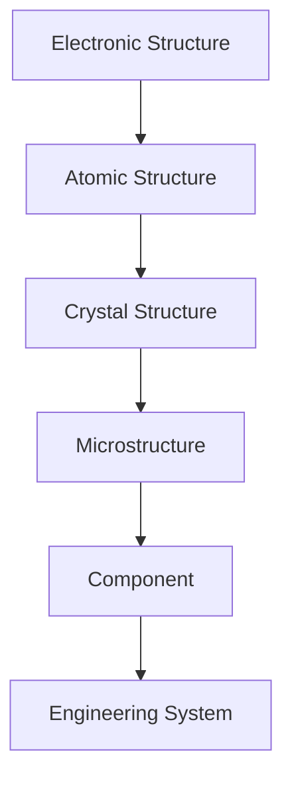
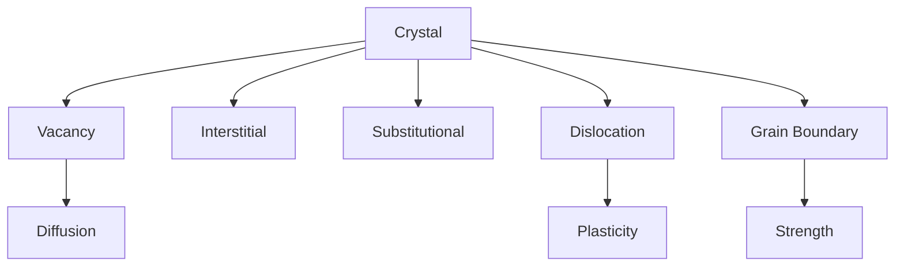
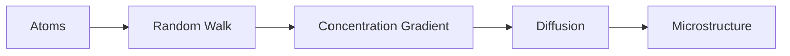
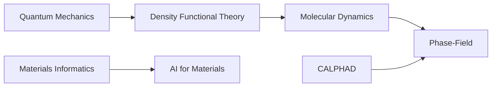

# Foundational Diagrams

## Purpose

These diagrams define the basic visual language for materials-science structure, scale, defects, diffusion, and field-level orientation.

## Scope

Use this file for diagrams that introduce durable mental models across multiple domains.

## Modules Using These Diagrams

- Module 01 — Foundations of Materials Science
- Roadmaps
- Future domain pages

## Related Domains

- Modern Materials Science
- Computational Materials
- Crystallography
- Diffusion
- Microstructure
- Multiscale Modeling

## Related Reference Documents

- [../../STYLE-GUIDES/MERMAID.md](../../STYLE-GUIDES/MERMAID.md)
- [../thermodynamics/THERMODYNAMIC-QUANTITIES.md](../thermodynamics/THERMODYNAMIC-QUANTITIES.md)

---

# D-001 — Processing → Structure → Properties → Performance

## Purpose

The central mental model of Materials Science.

Used in:

- Module 01
- Foundations of Materials Science
- Microstructure
- Processing
- Mechanical Properties

---

# D-002 — Structural Hierarchy

## Purpose

Shows the hierarchy of structural scales.

Used in:

- Module 01
- Crystallography
- Electronic Structure
- Multiscale Modeling

---

# D-003 — Crystal Defects

## Purpose

Illustrates the primary defect families.

Used in:

- Crystal Defects
- Diffusion
- Mechanical Behavior

---

# D-004 — Diffusion

## Purpose

Conceptual view of diffusion.

Used in:

- Diffusion
- Kinetics
- Molecular Dynamics

---

# D-005 — Computational Materials Landscape

## Purpose

Maps computational methods to the field.

Used in:

- README
- Roadmaps
- Domain pages

