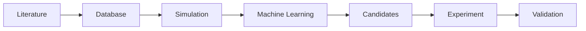
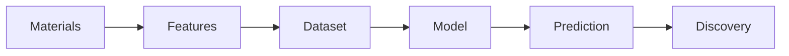

# Materials Informatics Diagrams

## Purpose

These diagrams define reusable visual models for materials discovery and data-to-model workflows.

## Scope

Use this file for diagrams where data, features, models, predictions, and discovery are the central concepts.

## Modules Using These Diagrams

- Materials Informatics
- AI for Materials
- High-Throughput Screening

## Related Domains

- Materials Informatics
- AI for Materials
- High-Throughput Screening
- Scientific Computing

## Related Reference Documents

- [../../STYLE-GUIDES/MERMAID.md](../../STYLE-GUIDES/MERMAID.md)
- [../../resources/software/README.md](../../resources/software/README.md)

---

# D-010 — Materials Discovery Pipeline

## Purpose

Illustrates modern materials discovery.

Used in:

- Materials Informatics
- AI for Materials
- High-Throughput Screening

---

# D-011 — Materials Informatics Pipeline

## Purpose

Shows how data becomes predictions.

Used in:

- Materials Informatics
- AI for Materials

