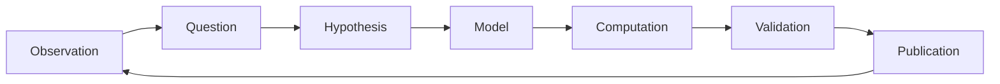

# Research Workflow Diagrams

## Purpose

These diagrams define reusable visual models for scientific reasoning, learning loops, research lifecycle, and computational study workflow.

## Scope

Use this file for general workflow diagrams that apply across domains.

## Modules Using These Diagrams

- Study Method
- Roadmaps
- Research Practice
- DFT
- Molecular Dynamics
- CALPHAD

## Related Domains

- Research Practice
- Scientific Computing
- Research Infrastructure
- Computational Materials

## Related Reference Documents

- [../../STYLE-GUIDES/MERMAID.md](../../STYLE-GUIDES/MERMAID.md)
- [../../EDITORIAL.md](../../EDITORIAL.md)

---

# D-006 — Scientific Workflow

## Purpose

General scientific reasoning process.

Used in:

- Study Method
- Research Practice

---

# D-007 — Learning Workflow

## Purpose

Default learning loop used throughout the Atlas.

Used in:

- Study Method
- Every roadmap

---

# D-008 — Research Lifecycle

## Purpose

Scientific research is iterative.

Used in:

- Research Practice
- Literature Review

---

# D-009 — Computational Workflow

## Purpose

High-level workflow of a computational materials study.

Used in:

- DFT
- Molecular Dynamics
- CALPHAD

