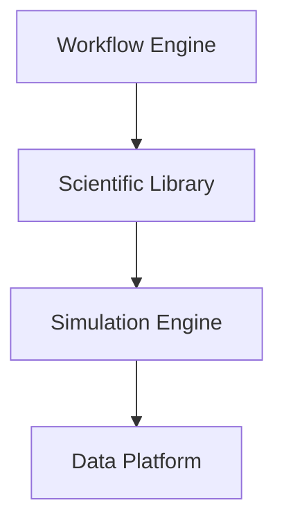

# Software Infrastructure Diagrams

## Purpose

These diagrams define reusable visual models for computational software layers and infrastructure.

## Scope

Use this file for diagrams where the relationship between engines, libraries, workflow systems, and data platforms is the central concept.

## Modules Using These Diagrams

- Software pages
- Scientific Python
- Workflow systems
- Research Infrastructure

## Related Domains

- Scientific Computing
- Research Infrastructure
- Computational Materials
- Materials Informatics

## Related Reference Documents

- [../../STYLE-GUIDES/MERMAID.md](../../STYLE-GUIDES/MERMAID.md)
- [../../resources/software/README.md](../../resources/software/README.md)

---

# D-012 — Software Ecosystem

## Purpose

High-level view of the computational software stack.

Used in:

- Software pages
- Scientific Python
- Workflow systems

