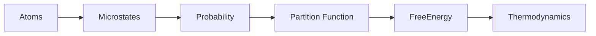

# Statistical Mechanics Diagrams

## Purpose

These diagrams define reusable visual models connecting atomic microstates, probability, partition functions, free energy, and macroscopic thermodynamics.

## Scope

Use this file for diagrams where statistical mechanics is the central bridge between microscopic physics and thermodynamic quantities.

## Modules Using These Diagrams

- Module 04 — Statistical Mechanics
- Module 03 — Thermodynamics
- Molecular Dynamics
- Monte Carlo

## Related Domains

- Statistical Mechanics
- Thermodynamics
- Molecular Dynamics
- Monte Carlo
- Free-Energy Methods

## Related Reference Documents

- [../../STYLE-GUIDES/MERMAID.md](../../STYLE-GUIDES/MERMAID.md)
- [thermodynamics.md](thermodynamics.md)

---

# D-108 — Statistical Mechanics Bridge

## Purpose

Connects microscopic physics with macroscopic thermodynamics.

### Interpretation

Statistical mechanics explains why thermodynamic quantities emerge from atomic behavior.
