# Thermodynamics Diagrams

## Purpose

These diagrams define reusable visual models for thermodynamic quantities, equilibrium, phase stability, phase diagrams, and computational thermodynamics.

## Scope

Use this file for diagrams where free energy, phase stability, equilibrium, thermodynamic driving forces, or CALPHAD-style modeling is the central concept.

## Modules Using These Diagrams

- Module 03 — Thermodynamics
- Module 07 — Density Functional Theory
- Module 09 — CALPHAD
- Module 10 — Phase-Field Methods
- Module 11 — Materials Informatics

## Related Domains

- Thermodynamics
- CALPHAD
- Phase-Field
- Density Functional Theory
- Computational Materials

## Related Reference Documents

- [../../STYLE-GUIDES/MERMAID.md](../../STYLE-GUIDES/MERMAID.md)
- [../thermodynamics/THERMODYNAMIC-QUANTITIES.md](../thermodynamics/THERMODYNAMIC-QUANTITIES.md)

---

# D-101 — Energy Landscape

## Purpose

Illustrates the concept of energy minimization.

Used in:

- Module 03 — Thermodynamics
- Module 07 — Density Functional Theory
- Module 09 — CALPHAD

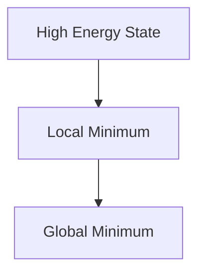

### Interpretation

Physical systems naturally evolve toward lower-energy configurations.

A local minimum is stable against small perturbations but may not be the most stable state.

The global minimum represents the thermodynamically preferred configuration.

---

# D-102 — Internal Energy to Equilibrium

## Purpose

Shows how thermodynamic quantities lead to equilibrium.

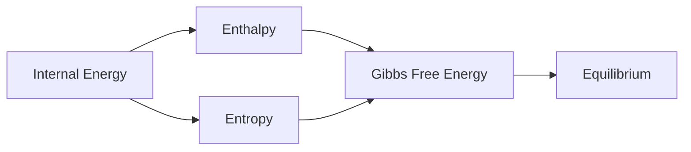

### Interpretation

Internal energy alone is insufficient.

Pressure and entropy contribute to the free energy that governs equilibrium.

---

# D-103 — Gibbs Free Energy and Phase Stability

## Purpose

Illustrates why the lowest Gibbs free energy determines the stable phase.

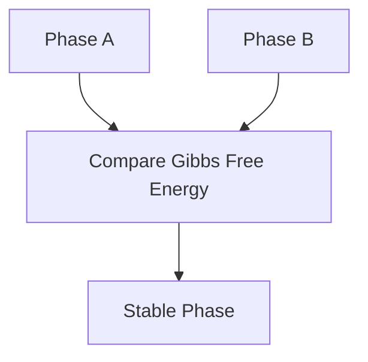

### Interpretation

Whichever phase has the lower Gibbs free energy is thermodynamically favored.

---

# D-104 — Temperature and Phase Stability

## Purpose

Temperature changes entropy contributions.

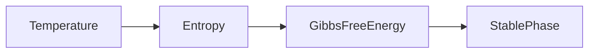

### Interpretation

A phase stable at one temperature may become unstable at another because entropy changes the free energy.

---

# D-105 — Chemical Potential

## Purpose

Illustrates particle exchange.

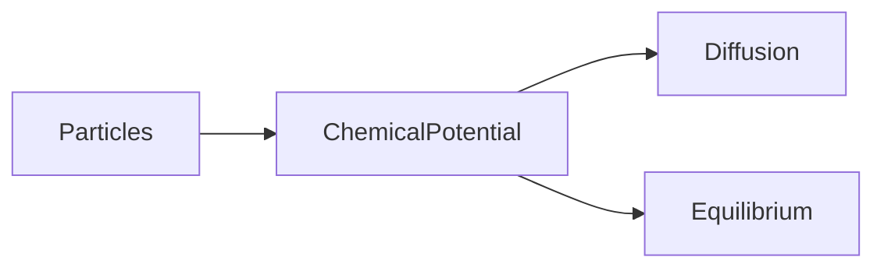

### Interpretation

Chemical potential determines whether atoms tend to move into or out of a region.

---

# D-106 — Thermodynamics vs Kinetics

## Purpose

Distinguishes two commonly confused concepts.

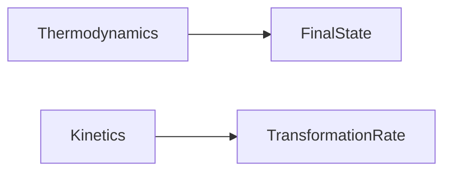

### Interpretation

Thermodynamics predicts what is possible.

Kinetics predicts how quickly it happens.

---

# D-107 — DFT to Materials Design

## Purpose

Places DFT inside the larger computational workflow.

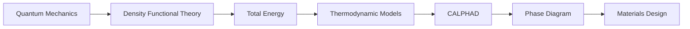

### Interpretation

DFT predicts energies.

Thermodynamic models transform energies into quantities useful for engineering.

---

# D-109 — Driving Force for Transformation

## Purpose

Explains why phase transformations occur.

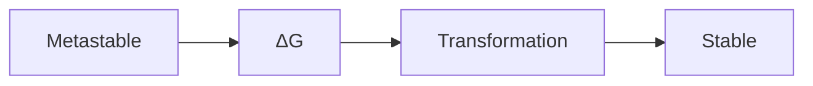

### Interpretation

The free-energy difference provides the driving force for transformation.

---

# D-110 — Binary Phase Diagram Concept

## Purpose

Shows the conceptual relationship between composition and equilibrium.

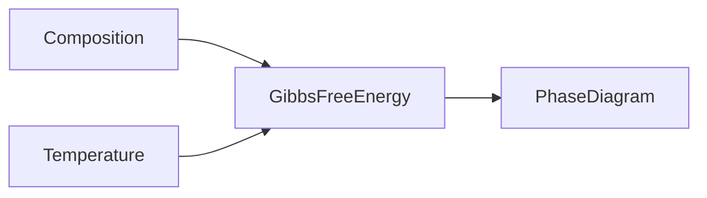

### Interpretation

Binary phase diagrams summarize equilibrium across temperature and composition.

---

# D-111 — Common Tangent Concept

## Purpose

Illustrates phase equilibrium conceptually.

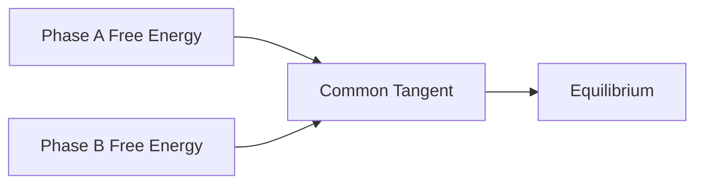

### Interpretation

The common tangent construction identifies compositions where two phases coexist in equilibrium.

---

# D-112 — Computational Thermodynamics

## Purpose

Shows how modern computational thermodynamics is assembled.

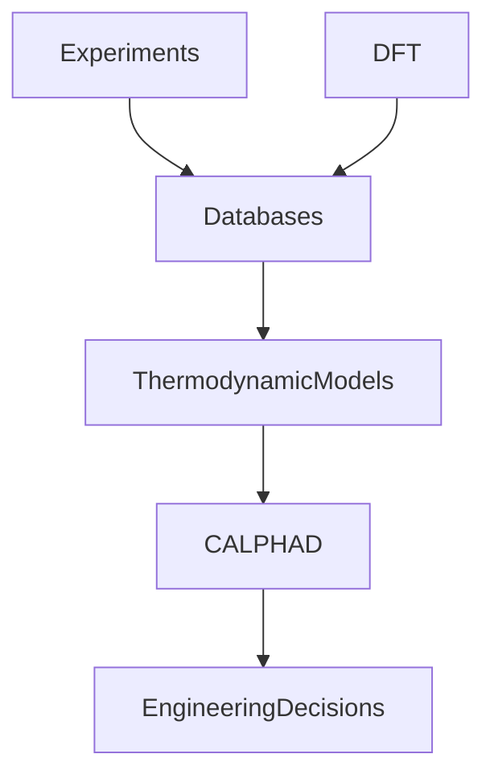

### Interpretation

Modern thermodynamic databases combine experimental and computational evidence to support engineering decisions.
