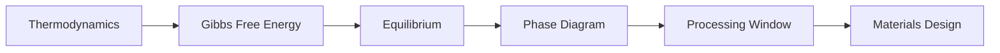
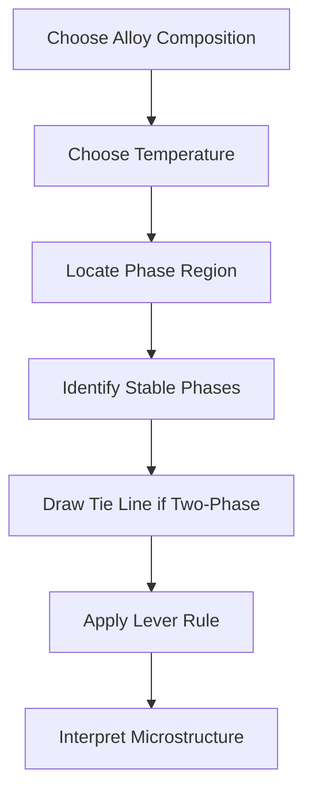
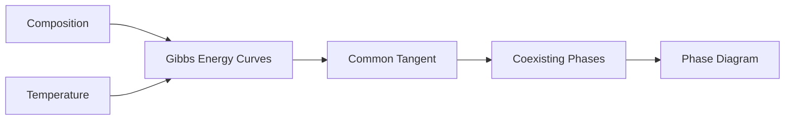
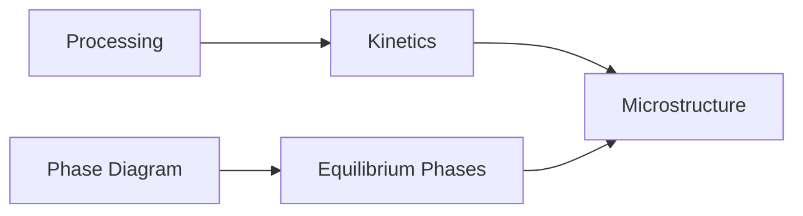
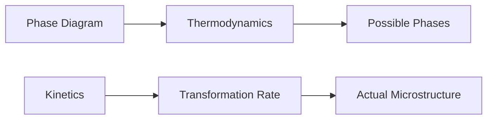
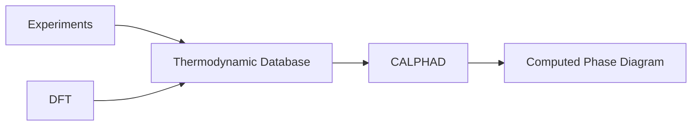
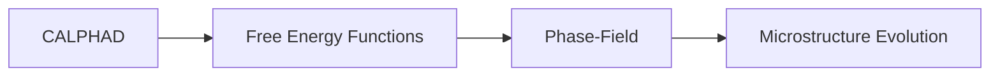

# Phase Diagrams

> Practical reference for reading, interpreting, and connecting phase diagrams to computational materials science.

---

# Purpose

Phase diagrams summarize thermodynamic equilibrium as a function of variables such as temperature, composition, and pressure.

This page is a practical reference.

It explains how to read phase diagrams, what they mean, and how they connect to thermodynamics, CALPHAD, and phase-field modeling.

---

# Why Phase Diagrams Matter

Phase diagrams are not just textbook figures.

They encode:

- stable phases
- phase boundaries
- transformation temperatures
- solubility limits
- two-phase regions
- processing windows
- alloy design constraints

In computational materials science, phase diagrams are both objects to interpret and objects to compute.

---

# Core Mental Model

---

# Basic Vocabulary

## Phase

A physically and chemically distinct region of matter.

Examples:

- liquid
- solid solution
- intermetallic compound
- ferrite
- austenite

## Component

A chemically independent constituent of the system.

Example:

In a binary A-B system, A and B are components.

## Phase Boundary

A line separating regions of different phase stability.

Crossing a boundary changes the equilibrium phase constitution.

## Single-Phase Region

A region where only one phase is stable.

## Two-Phase Region

A region where two phases coexist in equilibrium.

## Liquidus

The boundary above which the alloy is fully liquid.

## Solidus

The boundary below which the alloy is fully solid.

## Solvus

A boundary indicating the solubility limit of one phase in another.

## Eutectic Point

A composition and temperature where liquid transforms into two solid phases.

## Tie Line

A horizontal line drawn across a two-phase region at fixed temperature.

It connects the compositions of the coexisting phases.

## Lever Rule

A geometric method for estimating the fraction of each phase in a two-phase region.

---

# Reading a Binary Phase Diagram

---

# Interpretation Workflow

## Step 1 — Identify the axes

Most binary phase diagrams use:

- x-axis: composition
- y-axis: temperature

## Step 2 — Locate the alloy

Find the composition of interest.

## Step 3 — Locate the temperature

Draw a horizontal line at the temperature of interest.

## Step 4 — Identify the phase field

Determine whether the alloy is in:

- single-phase region
- two-phase region
- liquid + solid region
- eutectic region

## Step 5 — Use tie lines

In a two-phase region, the tie line gives the compositions of coexisting phases.

## Step 6 — Apply lever rule

Use relative distances along the tie line to estimate phase fractions.

---

# Thermodynamic Origin

Phase diagrams come from free energy minimization.

---

# Phase Diagrams vs Microstructures

Phase diagrams describe equilibrium.

They do not directly show microstructure.

Microstructure depends on:

- cooling rate
- diffusion
- nucleation
- growth
- deformation
- prior processing

---

# Thermodynamics vs Kinetics

A phase diagram tells what is thermodynamically favored.

It does not tell how fast transformation occurs.

---

# Computational Perspective

In computational materials science, phase diagrams can be generated from thermodynamic models.

---

# Relationship to CALPHAD

CALPHAD turns thermodynamic models into computed phase diagrams.

It uses:

- experimental measurements
- assessed thermodynamic functions
- DFT inputs where appropriate
- database models

---

# Relationship to Phase-Field

Phase-field models often use thermodynamic information from phase diagrams or CALPHAD databases.

---

# Common Mistakes

## Mistake 1 — Treating phase diagrams as microstructure maps

Phase diagrams show equilibrium phases, not actual microstructures.

## Mistake 2 — Ignoring kinetics

A phase may be thermodynamically favored but kinetically inaccessible.

## Mistake 3 — Memorizing diagrams

Understand how to read them instead.

## Mistake 4 — Confusing phase fraction and composition

Phase composition and phase fraction are different.

Tie lines give phase compositions.

Lever rule gives phase fractions.

## Mistake 5 — Forgetting assumptions

Most phase diagrams assume equilibrium.

Real processing may not reach equilibrium.

---

# Used By

- Module 01 — Foundations of Materials Science
- Module 03 — Thermodynamics
- Module 09 — CALPHAD
- Module 10 — Phase-Field Methods

---

# Related Reference Pages

- THERMODYNAMIC-QUANTITIES.md
- THERMODYNAMIC-DIAGRAMS.md
- GLOSSARY.md

