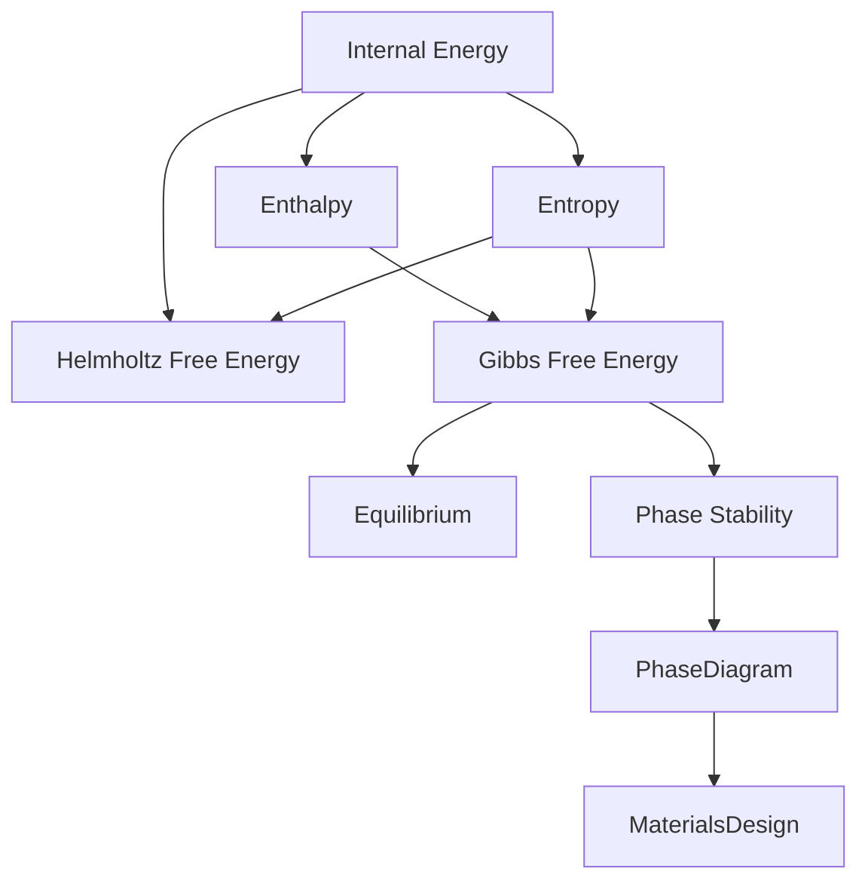
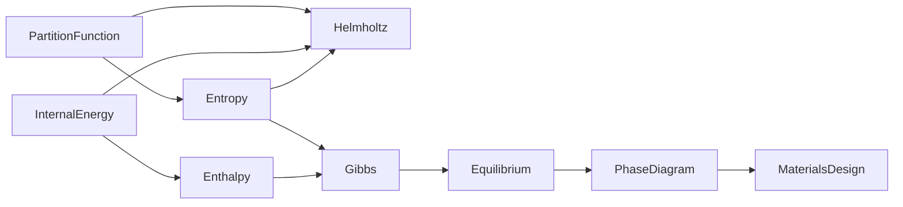

# Thermodynamic Quantities

> Canonical reference for the fundamental thermodynamic quantities used throughout Materials Atlas.

---

# Purpose

This document defines the core thermodynamic quantities used across Computational Materials Science.

It is intended as a long-lived reference rather than a learning module.

Learning modules should link here instead of redefining these concepts.

---

# Concept Map



---

# How To Read This Page

Each quantity is described from four perspectives.

- Physical meaning
- Mathematical definition
- Computational meaning
- Why it matters

---

# Internal Energy

## Symbol

**U**

---

## Physical Meaning

The total energy stored inside a system.

It includes contributions from:

- atomic interactions
- chemical bonding
- electronic structure
- lattice vibrations

---

## Mathematical Definition

```
U
```

The exact expression depends on the system.

---

## Computational Meaning

Many atomistic simulations ultimately estimate internal energy.

Examples:

- Density Functional Theory
- Molecular Dynamics
- Monte Carlo

---

## Why It Matters

Internal energy is the starting point for every other thermodynamic potential.

---

## Used By

- DFT
- Molecular Dynamics
- Statistical Mechanics

---

## Related Quantities

- Enthalpy
- Helmholtz Free Energy

---

## Common Misconceptions

Internal energy does not determine equilibrium by itself.

---

# Enthalpy

## Symbol

**H**

---

## Physical Meaning

Energy including pressure-volume work.

Useful for systems at constant pressure.

---

## Mathematical Definition

```
H = U + PV
```

---

## Computational Meaning

Frequently used when comparing phases under laboratory conditions.

---

## Why It Matters

Many engineering processes occur under approximately constant pressure.

---

## Used By

- CALPHAD
- Phase diagrams
- Materials processing

---

## Related Quantities

- Internal Energy
- Gibbs Free Energy

---

## Common Misconceptions

Enthalpy alone does not determine phase stability.

Entropy must also be considered.

---

# Entropy

## Symbol

**S**

---

## Physical Meaning

A measure of the number of accessible microscopic configurations.

Entropy is not simply "disorder."

It measures how many microscopic states correspond to the same macroscopic state.

---

## Mathematical Definition

```
S = kB ln(W)
```

where:

- kB is the Boltzmann constant
- W is the number of accessible microstates

---

## Computational Meaning

Entropy is difficult to compute directly.

Many computational methods estimate energy more accurately than entropy.

---

## Why It Matters

Entropy explains why temperature changes equilibrium.

---

## Used By

- Statistical Mechanics
- CALPHAD
- Phase Stability

---

## Related Quantities

- Gibbs Free Energy
- Helmholtz Free Energy

---

## Common Misconceptions

Entropy does not always increase locally.

Only isolated systems obey the simple "entropy increases" statement.

---

# Helmholtz Free Energy

## Symbol

**A** or **F**

---

## Physical Meaning

The energy available to perform useful work at constant temperature and constant volume.

---

## Mathematical Definition

```
A = U − TS
```

---

## Computational Meaning

Common in:

- Statistical Mechanics
- Molecular Dynamics
- Monte Carlo simulations

---

## Why It Matters

Many atomistic simulations naturally operate at constant volume.

---

## Used By

- Molecular Dynamics
- Monte Carlo
- Statistical Mechanics

---

## Related Quantities

- Internal Energy
- Gibbs Free Energy

---

## Common Misconceptions

Helmholtz free energy is not interchangeable with Gibbs free energy.

They describe different thermodynamic conditions.

---

# Gibbs Free Energy

## Symbol

**G**

---

## Physical Meaning

The thermodynamic potential minimized at constant temperature and pressure.

---

## Mathematical Definition

```
G = H − TS
```

or

```
G = U + PV − TS
```

---

## Computational Meaning

The central quantity in Computational Materials Science.

Most questions about phase stability ultimately reduce to comparing Gibbs free energy.

---

## Why It Matters

Equilibrium corresponds to minimum Gibbs free energy.

---

## Used By

- CALPHAD
- Phase diagrams
- Materials Design
- Thermodynamic databases

---

## Related Quantities

- Enthalpy
- Entropy
- Chemical Potential

---

## Common Misconceptions

DFT usually computes total energy.

It does **not** directly compute Gibbs free energy.

Additional thermodynamic models are required.

---

# Chemical Potential

## Symbol

**μ**

---

## Physical Meaning

The change in free energy caused by adding one particle.

---

## Mathematical Definition

```
μ = ∂G / ∂N
```

---

## Computational Meaning

Chemical potential governs:

- diffusion
- phase equilibrium
- reactions
- defect formation

---

## Why It Matters

Many computational methods compare chemical potentials rather than total energies.

---

## Used By

- CALPHAD
- Diffusion
- Electrochemistry
- Battery Materials

---

## Related Quantities

- Gibbs Free Energy

---

## Common Misconceptions

Chemical potential is not a chemical concentration.

---

# Partition Function

## Symbol

**Z**

---

## Physical Meaning

The bridge between microscopic physics and macroscopic thermodynamics.

---

## Mathematical Definition

```
Z = Σ exp(−Ei / kBT)
```

---

## Computational Meaning

Most thermodynamic quantities can be derived from the partition function.

---

## Why It Matters

Statistical Mechanics begins with the partition function.

Thermodynamics emerges from it.

---

## Used By

- Statistical Mechanics
- Monte Carlo
- Molecular Dynamics

---

## Related Quantities

- Entropy
- Helmholtz Free Energy

---

# Relationships



---

# Which Quantity Is Minimized?

| Conditions | Quantity |
|------------|----------|
| Constant Energy | Internal Energy |
| Constant Temperature + Volume | Helmholtz Free Energy |
| Constant Temperature + Pressure | Gibbs Free Energy |

---

# Computational Materials Perspective


---

# Relationship to the Curriculum

## Primary Module

- Module 03 — Thermodynamics for Computational Materials

## Supporting Modules

- Module 04 — Statistical Mechanics
- Module 07 — Density Functional Theory
- Module 09 — CALPHAD
- Module 10 — Phase-Field Methods

---

# Related Domains

- Thermodynamics
- Statistical Mechanics
- Phase Stability
- CALPHAD

---

# Key Takeaways

- Internal Energy describes the energy stored in a system.
- Enthalpy accounts for pressure-volume work.
- Entropy measures the number of accessible microscopic states.
- Helmholtz Free Energy governs constant-volume systems.
- Gibbs Free Energy governs constant-pressure equilibrium.
- Chemical Potential determines particle exchange.
- The Partition Function connects microscopic physics to macroscopic thermodynamics.

Together, these quantities form the thermodynamic language used throughout Computational Materials Science.