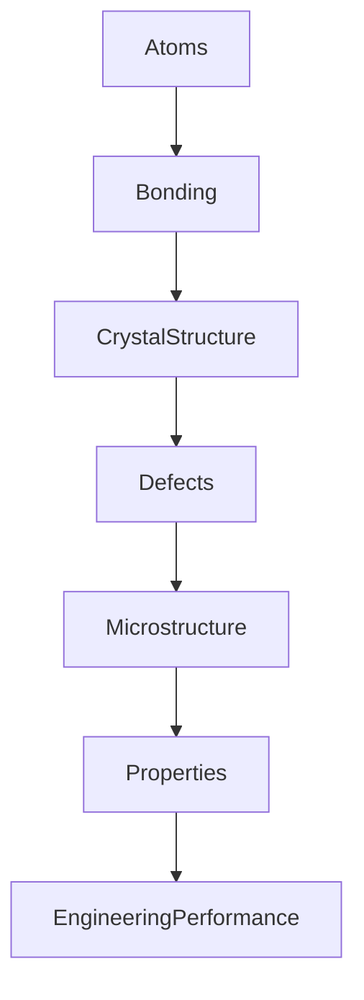
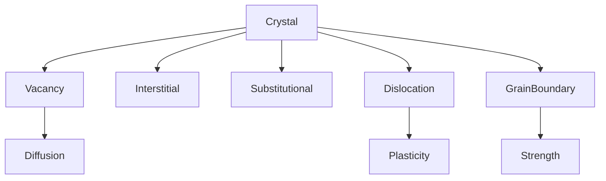
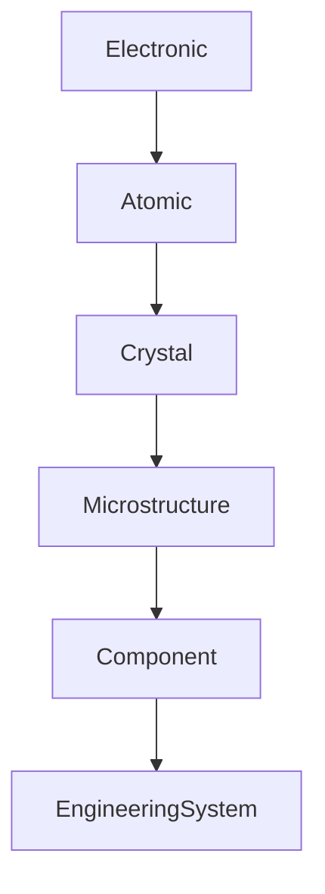
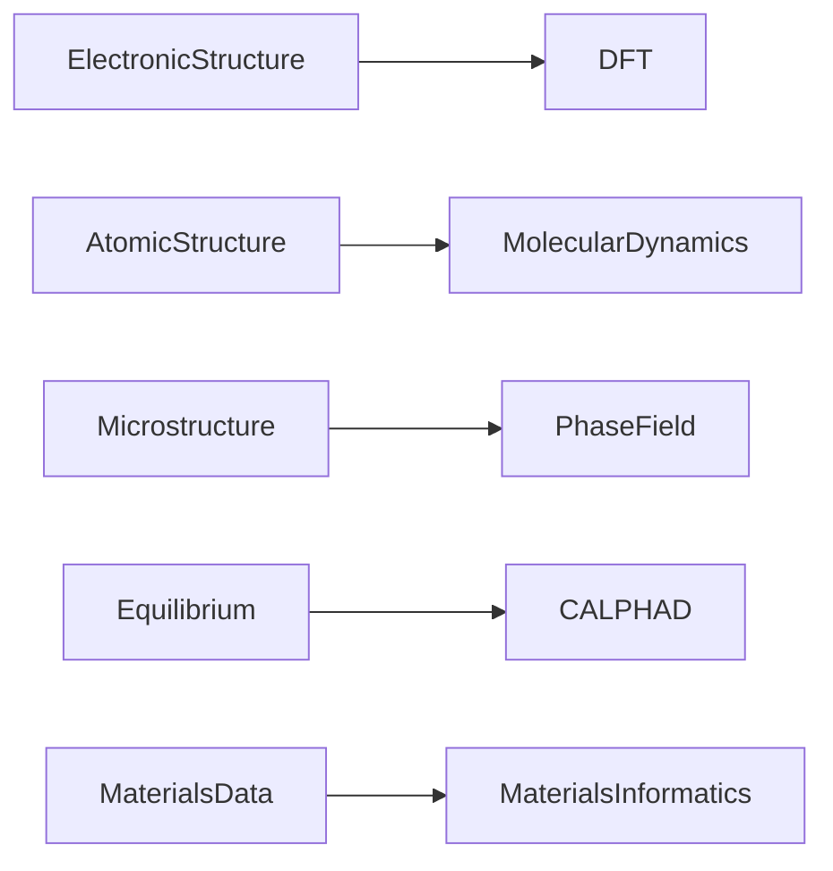
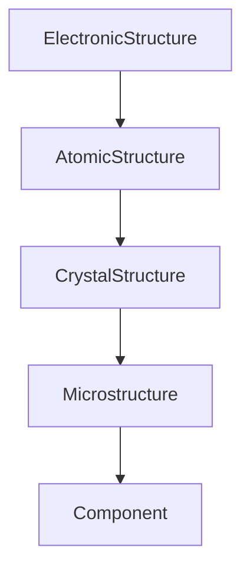
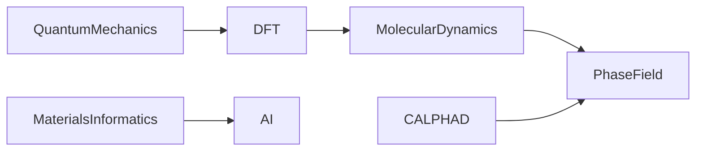

# Module 01 — Foundations of Materials Science

> Learn to think like a Computational Materials Scientist.

---

# Purpose

This module builds the central mental model of Materials Science:

> **Structure determines properties.**

Everything that follows in this curriculum—from Density Functional Theory to Materials Informatics—is ultimately an attempt to understand, predict, or manipulate this relationship.

Rather than studying materials by category, this module develops the conceptual framework that explains why materials behave the way they do.

---

# Why This Module Exists

Computational Materials Science is fundamentally predictive.

Prediction requires understanding causal relationships.

Every computational method eventually answers one of these questions:

- How does processing change structure?
- How does structure determine properties?
- How do properties determine performance?
- Which part of this chain can we compute?

---

# The Core Mental Model

This PSPP (Processing → Structure → Properties → Performance) framework is the backbone of modern Materials Science.

Everything in this curriculum connects to one or more links in this chain.

---

# Another Way to See It

Computational methods operate at different points in this hierarchy.

---

# Learning Philosophy

Do not memorize materials.

Build mental models.

Whenever you encounter a new material, ask:

- What is its structure?
- What defects dominate?
- What mechanisms govern its behavior?
- Which computational method could model it?

---

# Prerequisites

- Module 00

---

# Capability Map

| Capability                  | Primary Resource | Artifact         | Mastery Gate                |
|-----------------------------|------------------|------------------|-----------------------------|
| Structure–Property Thinking | Callister        | Markdown         | Explain PSPP                |
| Crystal Defects             | Callister        | Notebook         | Visualize defects           |
| Diffusion                   | Callister        | Simulation       | Random walk                 |
| Phase Diagrams              | Callister        | Notebook         | Interpret equilibrium       |
| Materials Classification    | Callister        | Comparison table | Explain dominant mechanisms |

---

# Learning Outcomes

After completing this module you should be able to:

- explain the PSPP framework
- distinguish atomic, crystal, microstructural and macroscopic scales
- explain why defects exist
- explain diffusion conceptually
- interpret binary phase diagrams
- explain strengthening mechanisms
- identify which computational methods operate at different length scales

---

# Scope

## Included

- Structure–Property relationships
- Crystal defects
- Diffusion
- Phase diagrams
- Strengthening mechanisms
- Materials classification

## Excluded

- Density Functional Theory
- Molecular Dynamics
- CALPHAD
- Phase-Field
- Quantum Mechanics

Those appear in later modules.

---

# Canonical Resources

## Primary Book

### William D. Callister Jr.

Read:

- Chapter 4 — Imperfections in Solids
- Chapter 5 — Diffusion
- Selected sections on Phase Diagrams
- Selected sections on Mechanical Behavior

Focus on concepts.

Ignore lengthy mathematical derivations.

---

## Videos

MIT OpenCourseWare

Continue selected lectures from:

**3.091 – Introduction to Solid State Chemistry**

Watch only lectures covering:

- crystal defects
- diffusion
- phase transformations

---

# Four-Week Study Plan

## Week 1

### Read

Callister Chapter 4

### Build

Notebook:

`01-crystal-defects.ipynb`

Visualize:

- vacancies
- interstitials
- substitutional atoms
- edge dislocations
- screw dislocations
- grain boundaries

---

## Week 2

### Read

Callister Chapter 5

### Build

Notebook:

`02-diffusion.ipynb`

Implement:

- random walk
- concentration profiles
- Fick intuition

---

## Week 3

### Read

Phase Diagrams

### Build

Notebook:

`03-phase-diagrams.ipynb`

Visualize:

- binary systems
- eutectic systems
- equilibrium regions

---

## Week 4

Study strengthening mechanisms.

Create comparison tables.

Review all notebooks.

Complete oral review with ChatGPT.

---

# Mental Models

## Crystal Defects

---

## Diffusion

---

## Length Scales

---

## Computational Methods

---

# Practical Work

## Notebook 01

Crystal Defects Explorer

Generate simple defects programmatically.

---

## Notebook 02

Random Walk Simulation

Implement diffusion from first principles.

---

## Notebook 03

Binary Phase Diagram Explorer

Visualize equilibrium.

---

## Notebook 04

Processing–Structure Explorer

Demonstrate how processing modifies structure and ultimately properties.

---

# Reading Workflow

For every chapter answer only:

## Big Idea

## Why It Matters

## Computational View

## Related Modules

## Artifact Produced

## Open Questions

---

# Mini Project

## Build a Materials Systems Map

Create a single Markdown document named:

`materials-systems-map.md`

The document should explain the complete Structure → Property chain using Mermaid diagrams and short explanations.

The goal is not to write an essay.

The goal is to build a reusable visual mental model.

---

## Diagram 1 — Processing → Structure → Properties → Performance

Write one short paragraph explaining each transition.

---

## Diagram 2 — Structural Hierarchy

For each level answer:

- What changes?
- What computational methods operate here?

---

## Diagram 3 — Crystal Defects

Explain why perfect crystals are rare.

---

## Diagram 4 — Diffusion

Describe each step in one or two sentences.

---

## Diagram 5 — Computational Materials Landscape

For every method explain:

- What scale does it operate on?
- What questions does it answer?
- Which later module covers it?

---

## Reflection

Finish the project by answering:

- Which diagram was hardest to explain?
- Which concepts still feel unclear?
- Which computational method are you most curious about?
- Which module are you most excited to begin?

---

# Mastery Gates

## Structure–Property Thinking

Can you explain why changing processing changes properties?

---

## Crystal Defects

Can you explain:

- vacancies
- interstitials
- substitutional atoms
- dislocations
- grain boundaries

without consulting your notes?

---

## Diffusion

Can you explain diffusion using:

- physical intuition
- random walks
- concentration gradients

without equations?

---

## Phase Diagrams

Can you:

- identify phases?
- explain equilibrium?
- interpret eutectic systems?

---

## Computational Thinking

Given an unfamiliar material, can you identify:

- the dominant structure level?
- the important defects?
- the likely computational method?

---

# Exit Criteria

Proceed only if you can:

- explain the PSPP framework
- explain the hierarchy of structure
- interpret simple phase diagrams
- explain diffusion conceptually
- explain why defects control many engineering properties
- identify which computational method is appropriate for different physical phenomena

---

# Relationships

## Supports Roadmap

- Module 03 — Thermodynamics
- Module 05 — Crystallography
- Module 07 — Density Functional Theory
- Module 08 — Molecular Dynamics
- Module 09 — CALPHAD
- Module 10 — Phase-Field

## Related Domains

- Foundations of Materials Science
- Crystal Defects
- Diffusion
- Phase Transformations
- Microstructure

## Primary Resources

- Callister
- MIT OpenCourseWare 3.091

---

# Estimated Duration

4 weeks

10–15 hours per week.

Advance based on mastery, not time.

---

# Continue With

**Module 02 — Scientific Computing with Python**
