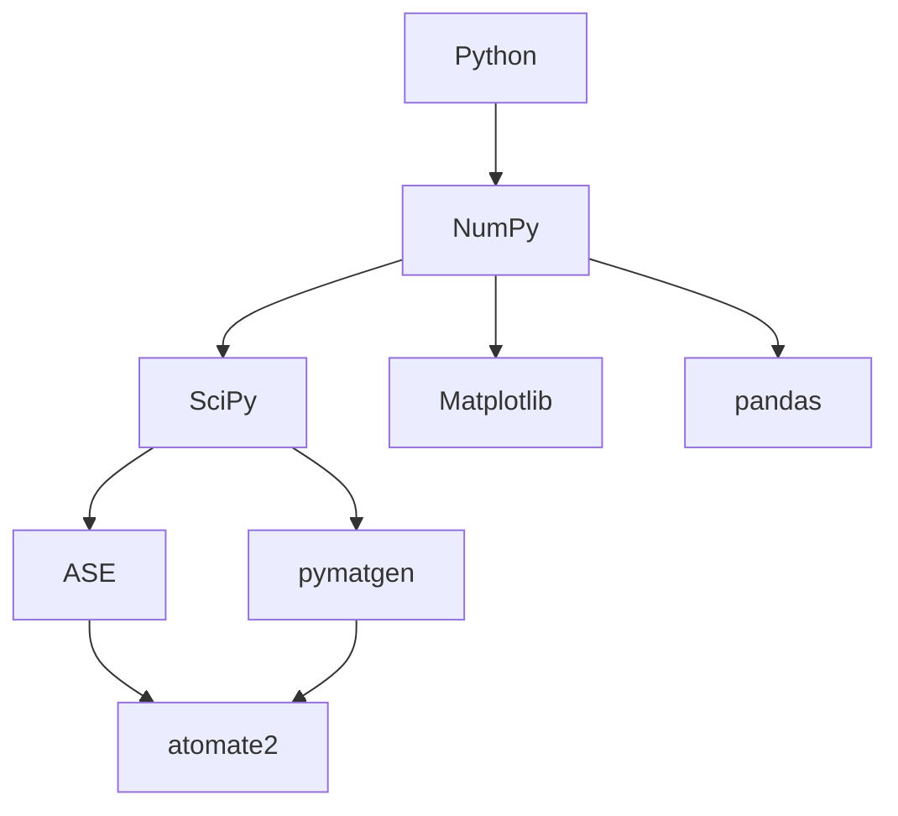
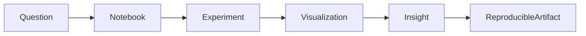
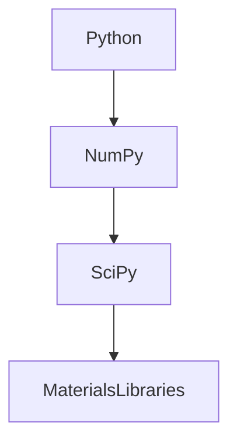
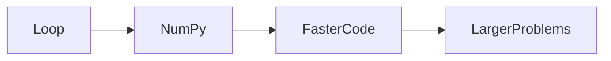
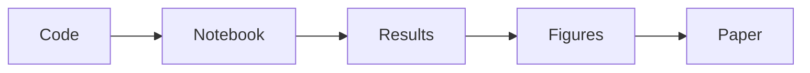

# Module 02 — Scientific Computing with Python

> Learn to think and work like a Computational Materials researcher using Python.

---

# Purpose

This module introduces the computational toolkit used throughout modern Computational Materials Science.

The objective is not to learn Python.

The objective is to learn how scientists use Python to:

- explore data
- prototype ideas
- perform numerical experiments
- visualize physical systems
- build reproducible research

Software engineering experience is assumed.

The focus is scientific computing.

---

# Why This Module Exists

Computational Materials Science is built on scientific software.

Every later module assumes the ability to manipulate arrays, solve numerical problems, visualize results, and build reproducible notebooks.

This module establishes that foundation.

---

# The Scientific Computing Stack

---

# Scientific Workflow

---

# Learning Philosophy

Scientific programming differs from production software.

Optimize for:

- correctness
- clarity
- reproducibility

Not for:

- abstraction
- framework design
- architectural elegance

The notebook is a scientific instrument.

---

# Prerequisites

- Module 00
- Module 01

---

# Capability Map

| Capability | Primary Resource | Artifact | Mastery Gate |
|------------|------------------|----------|--------------|
| NumPy Thinking | Scientific Python | Notebook | Vectorized solutions |
| Scientific Plotting | Matplotlib | Figures | Publication-quality plots |
| Scientific Computing | SciPy | Notebook | Numerical methods |
| Reproducible Research | Jupyter | Notebook | Clean reproducible workflow |
| Materials Python Ecosystem | ASE, pymatgen | Mini project | Navigate ecosystem |

---

# Learning Outcomes

After completing this module you should be able to:

- work naturally with NumPy arrays
- think in vectorized operations
- visualize scientific data
- solve simple numerical problems
- build reproducible notebooks
- understand the role of the major scientific Python libraries

---

# Scope

Included

- NumPy
- SciPy
- Matplotlib
- pandas
- Jupyter
- Virtual environments
- Scientific workflows
- Reproducibility

Excluded

- Machine Learning
- Deep Learning
- Parallel Computing
- DFT APIs
- Molecular Dynamics APIs

---

# Canonical Resources

## Primary

Scientific Python Lecture Notes

Read selected sections covering:

- NumPy
- SciPy
- Matplotlib
- Jupyter

---

## Secondary

NumPy documentation

Matplotlib documentation

Only as references.

---

# Four-Week Study Plan

## Week 1

Focus:

NumPy

Build:

- vector operations
- broadcasting
- matrix manipulation

Notebook:

`01-numpy-foundations.ipynb`

---

## Week 2

Focus:

Scientific visualization

Build:

publication-quality plots

Notebook:

`02-visualization.ipynb`

---

## Week 3

Focus:

SciPy

Implement:

- interpolation
- optimization
- integration

Notebook:

`03-scipy.ipynb`

---

## Week 4

Focus:

Reproducible research

Organize notebooks.

Refactor.

Document.

---

# Mental Models

## Scientific Software Stack

---

## Vectorization

---

## Reproducible Research

---

# Practical Work

## Notebook 01

NumPy Foundations

---

## Notebook 02

Scientific Plotting

---

## Notebook 03

SciPy Experiments

---

## Notebook 04

Materials Data Exploration

Load a small Materials Project dataset.

Visualize it.

---

# Reading Workflow

For every resource answer:

## Big Idea

## Why It Matters

## Computational View

## Artifact

## Open Questions

---

# Mini Project

## Scientific Computing Toolkit

Create a repository containing:

- four clean notebooks
- reusable plotting utilities
- reusable NumPy helpers
- reproducible environment
- README

The project should be usable as the starting point for future modules.

---

# Mastery Gates

Can you:

- eliminate unnecessary Python loops?
- explain broadcasting?
- create publication-quality figures?
- solve simple numerical problems?
- build reproducible notebooks?
- explain when SciPy is needed?

---

# Exit Criteria

Proceed only if you can:

- think naturally in arrays
- produce publication-quality visualizations
- write clean scientific notebooks
- reproduce an experiment from scratch
- explain the role of NumPy, SciPy, pandas, Matplotlib, ASE, and pymatgen

---

# Relationships

## Supports Roadmap

- Module 03 — Thermodynamics
- Module 07 — Density Functional Theory
- Module 08 — Molecular Dynamics
- Module 09 — CALPHAD
- Module 11 — Materials Informatics

## Related Domains

- Scientific Computing
- Scientific Software
- Python Ecosystem

## Primary Resources

- Scientific Python Lecture Notes
- NumPy
- SciPy
- Matplotlib

---

# Estimated Duration

4 weeks

10–15 hours per week.

Advance based on mastery.

---

# Continue With

**Module 03 — Thermodynamics for Computational Materials**