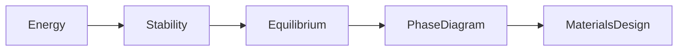
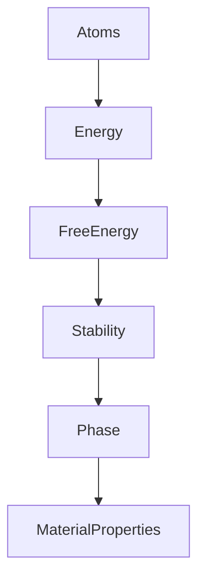
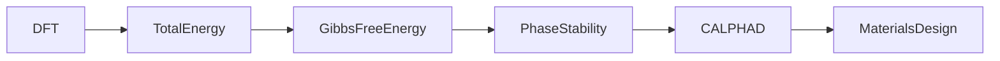
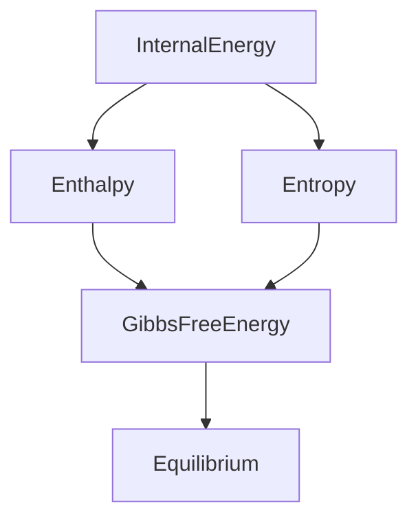
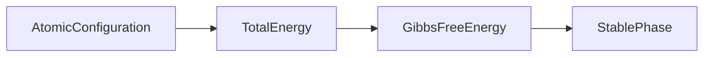
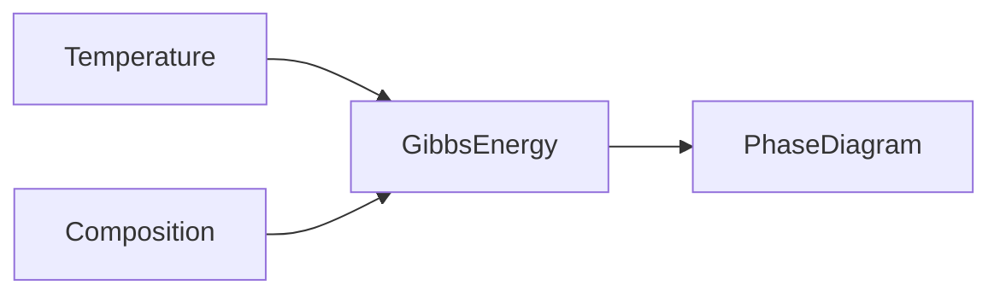

# Module 03 — Thermodynamics for Computational Materials

> Learn thermodynamics as the language of materials stability, equilibrium, and prediction.

---

# Purpose

Thermodynamics is the foundation of Computational Materials Science.

Almost every computational method—Density Functional Theory (DFT), CALPHAD, Phase-Field Modeling, Molecular Dynamics, and Materials Informatics—either predicts, approximates, or optimizes thermodynamic quantities.

The goal of this module is **not** to memorize equations.

The goal is to build an intuition for why materials exist, transform, and remain stable.

---

# Why This Module Exists

The central question of thermodynamics is simple:

> Why does one material state exist instead of another?

Every later computational method ultimately attempts to answer this question.

---

# Big Picture



---

# Learning Outcomes

After completing this module, you should be able to:

- explain the First, Second, and Third Laws in physical terms
- interpret internal energy, enthalpy, entropy, and Gibbs free energy
- explain why equilibrium minimizes Gibbs free energy
- understand why phase diagrams exist
- distinguish thermodynamics from kinetics
- understand why DFT predicts energies rather than directly predicting materials
- explain why CALPHAD is fundamentally a thermodynamic framework

---

# Scientific Question

The entire module revolves around one question:

> Which material state is thermodynamically favored?

Everything else is a consequence.

---

# Mental Model



---

# Computational Context



---

# Prerequisites

- Module 00
- Module 01
- Module 02

---

# Scope

Included

- First Law
- Second Law
- Third Law
- Internal Energy
- Enthalpy
- Entropy
- Gibbs Free Energy
- Chemical Potential
- Phase Equilibrium
- Binary Phase Diagrams

Excluded

- Statistical Mechanics
- CALPHAD algorithms
- Phase-Field mathematics
- Non-equilibrium thermodynamics

Those topics appear in later modules.

---

# Canonical Resources

## Primary Textbook

David R. Gaskell

**Introduction to the Thermodynamics of Materials**

Read conceptually.

Do not solve every end-of-chapter exercise.

---

## Secondary

Callister

Relevant chapters only.

Use for intuition rather than depth.

---

## Optional

DeHoff

Use as preparation for CALPHAD.

---

# Study Strategy

For every concept answer four questions:

1. What does this quantity measure?
2. Why does nature minimize or maximize it?
3. How do computational methods estimate it?
4. Where will I use it later?

---

# Weekly Plan

## Week 1

### Energy

Topics

- System
- Surroundings
- State variables
- Internal Energy
- First Law

Mini Artifact

Create a one-page concept map explaining energy conservation.

---

## Week 2

### Entropy

Topics

- Disorder
- Reversibility
- Second Law
- Entropy generation

Mini Artifact

Create diagrams showing why entropy increases.

---

## Week 3

### Free Energy

Topics

- Enthalpy
- Gibbs Free Energy
- Helmholtz Free Energy
- Chemical Potential

Mini Artifact

Explain why equilibrium minimizes Gibbs Free Energy.

---

## Week 4

### Phase Equilibrium

Topics

- Equilibrium
- Phase diagrams
- Driving force
- Thermodynamic stability

Mini Artifact

Explain a binary phase diagram using free energy.

---

# Concept Relationships

## Thermodynamic Quantities



---

## Stability



---

## Phase Diagram



---

## Computational Perspective


---

# Scientific Notebook

Create one notebook for each topic.

```
01-energy.ipynb
02-entropy.ipynb
03-free-energy.ipynb
04-phase-diagrams.ipynb
```

Each notebook should contain:

- concise notes
- one diagram
- one visualization
- one Python example
- one reflection

---

# Mini Project

## Build a Thermodynamics Atlas

Create a Markdown document:

```
thermodynamics-atlas.md
```

It should explain:

- Internal Energy
- Enthalpy
- Entropy
- Gibbs Free Energy
- Chemical Potential
- Equilibrium
- Phase Stability

using only Mermaid diagrams and concise explanations.

---

# Reflection Questions

- Why does equilibrium correspond to minimum Gibbs free energy?
- Why is entropy necessary?
- Why can't DFT alone generate a phase diagram?
- Why is thermodynamics insufficient to predict transformation rates?
- Which concept still feels unintuitive?

---

# Mastery Gates

You are ready to continue only if you can explain:

- why Gibbs Free Energy governs equilibrium
- why entropy matters
- the difference between energy and free energy
- why stable materials correspond to energy minima
- why phase diagrams emerge from thermodynamics

without referring to equations.

---

# Relationships

## Supports Roadmap

- Module 04 — Statistical Mechanics
- Module 05 — Crystallography
- Module 07 — Density Functional Theory
- Module 09 — CALPHAD
- Module 10 — Phase-Field Methods

---

## Related Domains

- Thermodynamics
- Phase Stability
- Phase Diagrams
- CALPHAD

---

## Primary Resources

- Gaskell
- Callister
- DeHoff

---

# Estimated Duration

4 weeks

10–15 hours per week.

Proceed only after mastering the concepts.

---

# Continue With

**Module 04 — Statistical Mechanics for Computational Materials**
