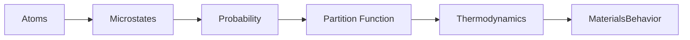
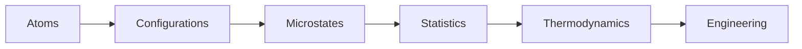
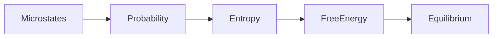
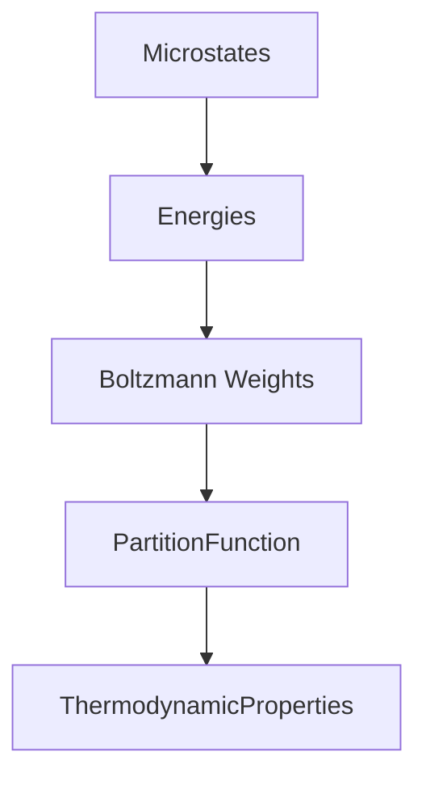

# Module 04 — Statistical Mechanics for Computational Materials

> Learn how macroscopic thermodynamics emerges from microscopic atomic behavior.

---

# Purpose

Thermodynamics describes **what** happens.

Statistical Mechanics explains **why** it happens.

This module introduces the probabilistic framework that connects atomic-scale physics with macroscopic thermodynamic behavior.

The objective is not to derive every equation.

The objective is to understand how Computational Materials Science bridges atoms and engineering.

---

# Why This Module Exists

Computational methods simulate atoms.

Engineering decisions depend on thermodynamics.

Statistical Mechanics explains how one becomes the other.

Without Statistical Mechanics:

- entropy has no physical meaning
- temperature is only a measured quantity
- Gibbs Free Energy appears arbitrary
- Molecular Dynamics becomes "atoms moving"
- Monte Carlo becomes "random sampling"

After this module, these concepts become parts of one coherent framework.

---

# Big Picture



---

# Guiding Question

> How do billions of atoms collectively produce the thermodynamic behavior we observe?

Everything in this module answers that question.

---

# Learning Outcomes

After completing this module you should be able to:

- explain the concept of a microstate
- distinguish microstates from macrostates
- explain why probability appears in physics
- understand the role of the partition function
- explain the statistical origin of entropy
- understand why free energy emerges naturally
- connect Statistical Mechanics to Molecular Dynamics and Monte Carlo

---

# Prerequisites

- Module 00 — Mathematical & Physical Recovery
- Module 01 — Foundations of Materials Science
- Module 02 — Scientific Python
- Module 03 — Thermodynamics

---

# Scope

Included

- Microstates
- Macrostates
- Probability
- Boltzmann Distribution
- Partition Function
- Canonical Ensemble
- Statistical Entropy
- Free Energy
- Connection to Molecular Dynamics
- Connection to Monte Carlo

Excluded

- Quantum Statistical Mechanics
- Fermi–Dirac Statistics
- Bose–Einstein Statistics
- Grand Canonical Ensemble
- Path Integrals

These topics belong to advanced study.

---

# Learning Philosophy

Do not memorize derivations.

Understand the physical meaning.

Whenever a new equation appears, ask:

1. What physical question does it answer?
2. Why is probability required?
3. Which computational method uses it?

---

# Canonical Resources

## Primary

Mark Tuckerman

**Statistical Mechanics: Theory and Molecular Simulation**

Read conceptually.

Do not attempt every derivation.

---

## Secondary

Daniel V. Schroeder

**An Introduction to Thermal Physics**

Focus on intuition.

---

## Reference

See:

- references/thermodynamics/THERMODYNAMIC-QUANTITIES.md
- references/diagrams/statistical-mechanics.md
- references/diagrams/thermodynamics.md

---

# Weekly Plan

## Week 1 — Microstates and Macrostates

Topics

- States
- Degrees of Freedom
- Phase Space
- Macroscopic Observables

Artifact

```
01-microstates.md
```

---

## Week 2 — Probability

Topics

- Random Variables
- Boltzmann Distribution
- Accessible States
- Ensemble Thinking

Artifact

```
02-boltzmann.ipynb
```

Visualize simple probability distributions.

---

## Week 3 — Partition Function

Topics

- Partition Function
- Free Energy
- Statistical Entropy
- Ensemble Average

Artifact

```
03-partition-function.md
```

---

## Week 4 — Computational Perspective

Topics

- Molecular Dynamics
- Monte Carlo
- Sampling
- Ensemble Averages

Artifact

```
04-statistical-mechanics-workflow.md
```

---

# Mental Models

## Microscopic to Macroscopic



---

## Statistical Origin of Entropy



---

## Partition Function



---

## Molecular Dynamics


---

## Monte Carlo


---

# Computational Context


---

# Reading Workflow

For every chapter answer:

## Big Idea

What is the central concept?

---

## Physical Meaning

What is nature doing?

---

## Computational Meaning

Where is this used?

---

## Connections

Which previous module does it depend on?

Which future module depends on it?

---

## Reflection

What still feels unintuitive?

---

# Practical Work

Create four notebooks.

```
01-microstates.ipynb
02-probability.ipynb
03-partition-function.ipynb
04-sampling.ipynb
```

The notebooks should prioritize visualization over mathematics.

---

# Mini Project

## Statistical Mechanics Atlas

Create

```
statistical-mechanics-atlas.md
```

Explain the following concepts using Mermaid diagrams and concise explanations:

- Microstates
- Macrostates
- Boltzmann Distribution
- Partition Function
- Entropy
- Free Energy
- Ensemble Average
- Molecular Dynamics
- Monte Carlo

The document should serve as a permanent reference.

---

# Reflection Questions

- Why does probability appear in physics?
- What information does a microstate contain?
- Why is entropy fundamentally statistical?
- Why does the partition function contain almost all thermodynamic information?
- Why can Molecular Dynamics recover thermodynamic properties?
- Why do Monte Carlo simulations work?

---

# Mastery Gates

Proceed only if you can explain:

- the difference between a microstate and a macrostate
- the physical meaning of entropy
- the purpose of the partition function
- the role of probability in thermodynamics
- why Molecular Dynamics and Monte Carlo produce thermodynamic predictions

without relying on equations.

---

# Relationships

## Supports Roadmap

- Module 07 — Density Functional Theory
- Module 08 — Molecular Dynamics
- Module 09 — CALPHAD

## Related Domains

- Statistical Mechanics
- Thermodynamics
- Molecular Dynamics
- Monte Carlo Methods

## Primary Resources

- Tuckerman
- Schroeder

---

# Estimated Duration

4 weeks

10–15 hours per week.

Advance based on mastery rather than time.

---

# Continue With

**Module 05 — Crystallography & Crystal Structures**
