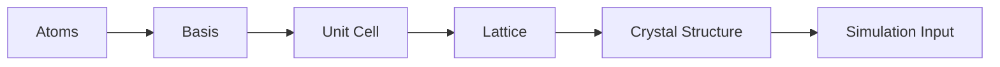
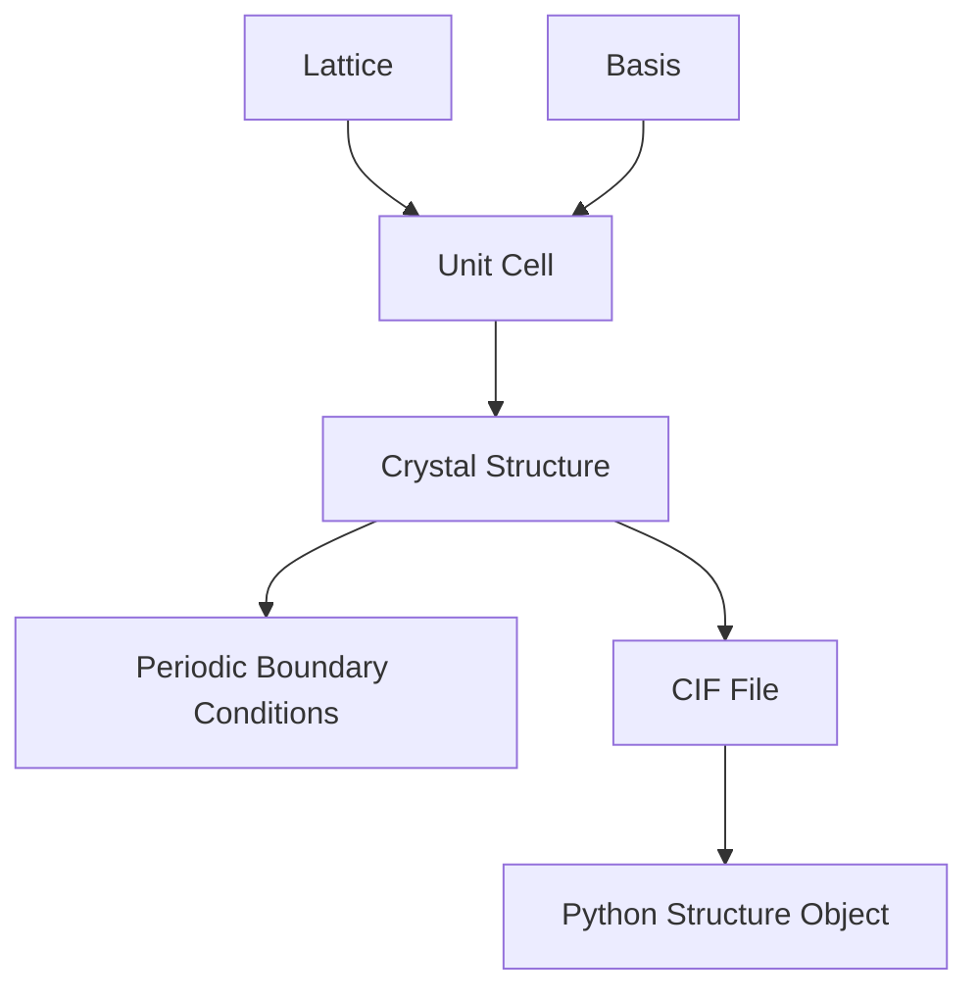
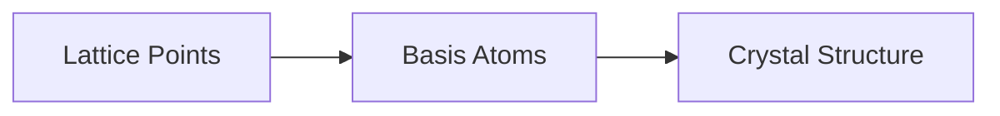
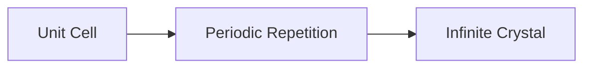
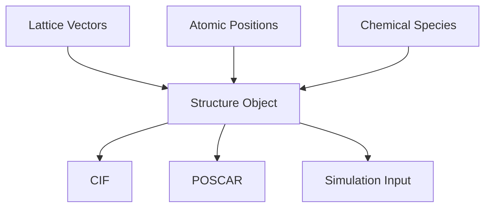
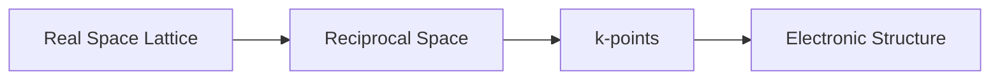

# Module 05 — Crystallography & Crystal Structures

> Understand how atoms are arranged in solids and how those arrangements become computational objects.

---

# Purpose

Crystallography is the structural language of Computational Materials Science.

Before learning electronic structure, Density Functional Theory, Molecular Dynamics, or Materials Informatics, you need to understand how solids are represented.

This module teaches crystal structures as both physical objects and computational data structures.

The goal is not to memorize all crystal systems.

The goal is to understand how atomic arrangement becomes something a computer can store, analyze, transform, and simulate.

---

# Why This Module Exists

Most computational materials tools assume that you understand:

- lattice vectors
- unit cells
- basis atoms
- symmetry
- periodic boundary conditions
- reciprocal space
- crystal structure files

Without crystallography, DFT inputs, pymatgen structures, CIF files, k-points, and Materials Project entries feel like disconnected technical details.

This module connects them.

---

# Guiding Question

> How do we represent an infinite crystal using finite data?

---

# Big Picture

---

# Learning Outcomes

After completing this module you should be able to:

- explain the difference between lattice, basis, and crystal structure
- distinguish unit cell and primitive cell
- identify common crystal structures such as FCC, BCC, and HCP
- explain periodic boundary conditions
- understand symmetry conceptually
- read and interpret CIF files
- create crystal structures using Python
- explain why reciprocal space appears in electronic structure calculations
- use ASE or pymatgen to inspect and transform crystal structures

---

# Prerequisites

- Module 00 — Mathematical & Physical Recovery
- Module 01 — Foundations of Materials Science
- Module 02 — Scientific Python
- Module 03 — Thermodynamics
- Module 04 — Statistical Mechanics

---

# Scope

Included:

- Lattice
- Basis
- Unit Cell
- Primitive Cell
- Crystal Systems
- Bravais Lattices
- FCC
- BCC
- HCP
- Miller Indices
- Symmetry
- Periodic Boundary Conditions
- Reciprocal Space
- CIF files
- pymatgen and ASE structure objects

Excluded:

- full group theory
- advanced crystallographic notation
- diffraction theory in depth
- band structure calculations
- phonons

Those appear later when needed.

---

# Core Mental Model

---

# Canonical Resources

## Primary

Callister

Use selectively for:

- crystal structures
- unit cells
- crystallographic directions
- crystallographic planes

Do not solve large numbers of crystallography exercises.

## Practical

pymatgen documentation

Use for:

- `Structure`
- `Lattice`
- CIF parsing
- symmetry analysis

## Practical

ASE documentation

Use for:

- `Atoms`
- builders
- visualization
- periodic systems

---

# Weekly Plan

## Week 1 — Lattice, Basis, and Unit Cell

Study:

- lattice
- basis
- unit cell
- primitive cell
- conventional cell

Build:

`01-lattice-basis-unit-cell.ipynb`

Implement simple 2D and 3D lattices using NumPy.

## Week 2 — Common Crystal Structures

Study:

- FCC
- BCC
- HCP
- coordination number
- packing factor

Build:

`02-common-crystal-structures.ipynb`

Generate and visualize FCC, BCC, and HCP using ASE or pymatgen.

## Week 3 — Planes, Directions, and Symmetry

Study:

- Miller indices
- crystallographic directions
- symmetry operations
- space groups conceptually

Build:

`03-planes-directions-symmetry.ipynb`

Create visual examples of planes and directions.

## Week 4 — Computational Representation

Study:

- CIF
- POSCAR
- pymatgen `Structure`
- ASE `Atoms`
- periodic boundary conditions
- reciprocal space intuition

Build:

`04-structure-files-and-python.ipynb`

Load, inspect, transform, and export structures.

---

# Mental Models

## Lattice + Basis

A lattice defines repeated positions.

A basis defines what atoms sit at each position.

Together they define a crystal structure.

## Unit Cell to Infinite Crystal

A finite unit cell represents an infinite periodic solid.

## Computational Crystal Representation

## Reciprocal Space

Reciprocal space becomes essential in electronic structure and DFT.

Do not try to master it here.

Build intuition first.

---

# Practical Work

## Notebook 01 — Lattice Construction

Create simple 2D and 3D lattices using NumPy.

Focus on:

- lattice vectors
- coordinate systems
- repeated points

## Notebook 02 — FCC, BCC, HCP

Generate crystal structures using ASE or pymatgen.

For each structure:

- visualize atoms
- compute coordination intuition
- compare packing qualitatively

## Notebook 03 — CIF Reader

Load a CIF file.

Extract:

- lattice parameters
- atomic species
- fractional coordinates
- Cartesian coordinates

## Notebook 04 — Structure Transformations

Use pymatgen or ASE to:

- create a supercell
- convert fractional to Cartesian coordinates
- export a structure file
- inspect symmetry if possible

---

# Mini Project

## Crystal Structure Explorer

Create:

`crystal-structure-explorer.md`

and supporting notebooks.

The project should explain:

- lattice
- basis
- unit cell
- primitive cell
- FCC
- BCC
- HCP
- CIF
- pymatgen `Structure`
- ASE `Atoms`

Use Mermaid diagrams, Python visualizations, and concise explanations.

The final artifact should help another software engineer understand how crystals become computational objects.

---

# Reflection Questions

- Why is a crystal structure more than a list of atoms?
- Why do we need periodic boundary conditions?
- What is the difference between a primitive and conventional cell?
- Why are fractional coordinates useful?
- Why does reciprocal space appear in DFT?
- Why do pymatgen and ASE both exist?

---

# Mastery Gates

Proceed only if you can:

- explain lattice, basis, and unit cell without notes
- generate FCC, BCC, and HCP structures in Python
- load and inspect a CIF file
- explain fractional vs Cartesian coordinates
- explain periodic boundary conditions conceptually
- explain why reciprocal space matters later

---

# Relationships

## Supports Roadmap

- Module 06 — Electronic Structure
- Module 07 — Density Functional Theory
- Module 08 — Molecular Dynamics
- Module 11 — Materials Informatics
- Module 12 — Machine Learning for Materials

## Related Domains

- Crystallography
- Crystal Structures
- Density Functional Theory
- Molecular Dynamics
- Materials Informatics

## Primary Resources

- Callister
- pymatgen documentation
- ASE documentation

---

# Estimated Duration

4 weeks

10–15 hours per week.

Advance based on mastery rather than time.

---

# Continue With

**Module 06 — Electronic Structure**

