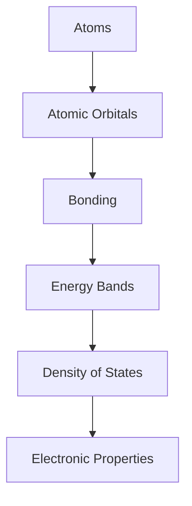
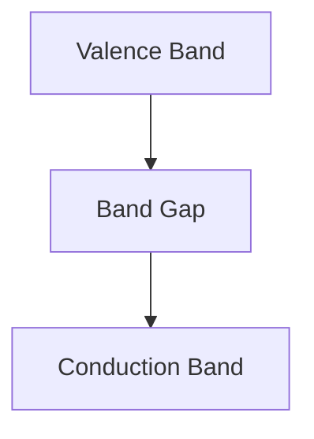
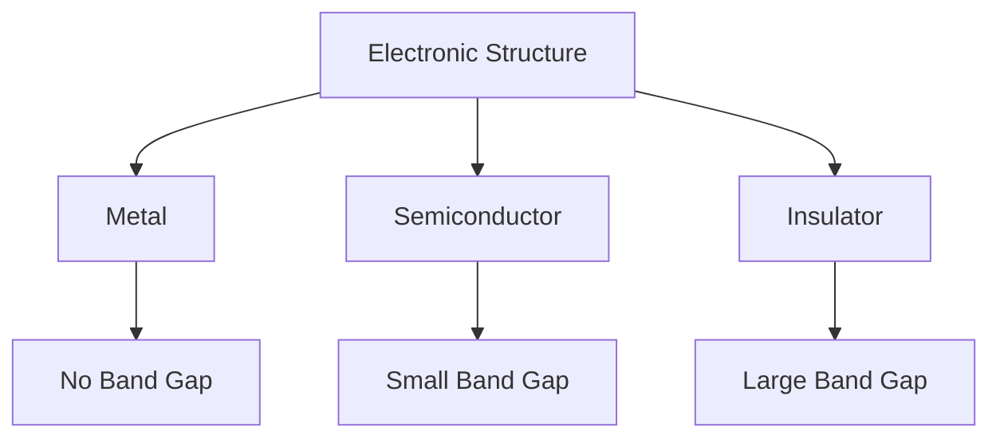

# Module 06 — Electronic Structure

> Build intuition for how electrons determine bonding, stability, and material properties.

---

# Purpose

Electronic structure is the bridge between atomic arrangement and material behavior.

This module explains why electrons matter in Computational Materials Science.

The goal is not to become a quantum physicist.

The goal is to understand enough electronic structure to make Density Functional Theory, band structures, bonding, conductivity, and materials stability meaningful.

---

# Why This Module Exists

Many material properties are controlled by electrons.

Examples include:

- bonding
- conductivity
- magnetism
- optical behavior
- band gaps
- chemical stability
- defect behavior

DFT and many first-principles methods are built on electronic structure.

Without this module, DFT becomes a black box.

---

# Guiding Question

> How do electrons determine the behavior of materials?

---

# Big Picture

---

# Learning Outcomes

After completing this module you should be able to:

- explain why electrons determine bonding
- distinguish atomic orbitals, molecular orbitals, and bands conceptually
- explain the origin of band gaps
- distinguish metals, semiconductors, and insulators electronically
- understand why reciprocal space matters
- explain why DFT focuses on electron density
- read basic band structure and density-of-states plots
- understand what electronic structure calculations try to predict

---

# Prerequisites

- Module 00 — Mathematical & Physical Recovery
- Module 01 — Foundations of Materials Science
- Module 02 — Scientific Python
- Module 03 — Thermodynamics
- Module 04 — Statistical Mechanics
- Module 05 — Crystallography & Crystal Structures

---

# Scope

Included:

- Electrons in solids
- Atomic orbitals
- Bonding
- Bands
- Band gaps
- Density of states
- Fermi level
- Metals, semiconductors, insulators
- Reciprocal space intuition
- Electronic structure as input to DFT

Excluded:

- full quantum mechanics
- many-body theory
- advanced solid-state physics
- detailed derivation of the Schrodinger equation
- DFT implementation details

Those appear later only where necessary.

---

# Core Mental Model

---

# Canonical Resources

## Primary

David Sholl and Janice Steckel

**Density Functional Theory: A Practical Introduction**

Use the early conceptual chapters.

Do not start DFT calculations yet.

## Secondary

MIT OpenCourseWare

Use introductory solid-state lectures covering:

- bonding
- bands
- semiconductors
- electronic properties

## Reference

Ashcroft & Mermin

**Solid State Physics**

Use only as a reference.

Do not read sequentially.

---

# Weekly Plan

## Week 1 — Electrons and Bonding

Study:

- electron configuration
- bonding
- orbital overlap
- metallic, ionic, and covalent bonding

Build:

`01-electrons-and-bonding.md`

## Week 2 — From Orbitals to Bands

Study:

- isolated atoms
- molecular orbitals
- bands in solids
- band gap intuition

Build:

`02-orbitals-to-bands.md`

## Week 3 — Band Structures and Density of States

Study:

- band structure
- density of states
- Fermi level
- metals, semiconductors, insulators

Build:

`03-band-structure-and-dos.ipynb`

## Week 4 — Electronic Structure as Computational Input

Study:

- why DFT exists
- why electron density matters
- why reciprocal space matters
- why total energy is important

Build:

`04-electronic-structure-to-dft.md`

---

# Mental Models

## From Atoms to Bands

## Band Gap

## Material Classes

## Electronic Structure to DFT

---

# Practical Work

## Artifact 01 — Bonding Map

Create a Markdown document explaining metallic, ionic, and covalent bonding and how bonding affects properties.

## Artifact 02 — Orbitals to Bands

Create a visual explanation of how atomic orbitals become bands in solids.

## Artifact 03 — Toy Density of States

Create a notebook that plots simple artificial density-of-states curves for a metal, semiconductor, and insulator.

## Artifact 04 — DFT Preparation Note

Write a short note answering:

> What does DFT need to compute, and why?

---

# Mini Project

## Electronic Structure Primer

Create:

`electronic-structure-primer.md`

The document should explain:

- why electrons matter
- how bonding emerges
- how bands form
- what band gaps mean
- how DOS differs from band structure
- why DFT is the next step

Use concise explanations and Mermaid diagrams.

---

# Mastery Gates

Proceed only if you can:

- explain bonding using electrons
- explain how bands form conceptually
- distinguish metal, semiconductor, and insulator electronically
- interpret a simple DOS plot
- explain why reciprocal space matters later
- explain why DFT is needed

---

# Relationships

## Supports Roadmap

- Module 07 — Density Functional Theory
- Module 08 — Molecular Dynamics
- Module 11 — Materials Informatics
- Module 12 — Machine Learning for Materials

## Related Domains

- Electronic Structure
- Density Functional Theory
- Crystallography
- Semiconductor Materials
- Materials Informatics

## Primary Resources

- Sholl & Steckel
- MIT OpenCourseWare
- Ashcroft & Mermin as reference

---

# Estimated Duration

4 weeks

10–15 hours per week.

---

# Continue With

**Module 07 — Density Functional Theory**

