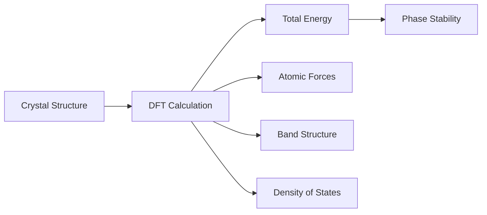
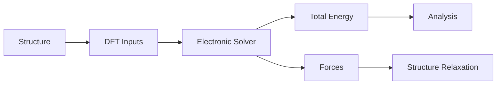
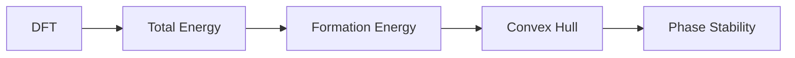
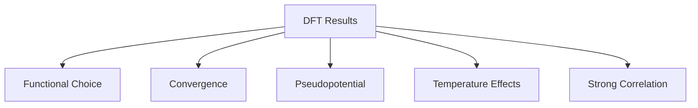

# Module 07 — Density Functional Theory

> Learn first-principles materials simulation without treating DFT as a black box.

---

# Purpose

Density Functional Theory is one of the central methods of Computational Materials Science.

It allows researchers to estimate material properties from electronic structure without fitting directly to experimental data.

The goal of this module is not to become a DFT theorist.

The goal is to understand what DFT computes, why it works, where it fails, and how it fits into modern computational materials workflows.

---

# Why This Module Exists

DFT connects electronic structure to materials properties.

It is used to compute:

- total energies
- relaxed structures
- forces
- band structures
- density of states
- defect energetics
- phase stability inputs
- high-throughput materials data

Many modern materials databases, including Materials Project, rely heavily on DFT.

---

# Guiding Question

> How can we predict materials properties from electrons and atomic structure?

---

# Big Picture

---

# Learning Outcomes

After completing this module you should be able to:

- explain what DFT computes
- explain why electron density matters
- distinguish total energy, forces, band structure, and density of states
- understand the role of exchange-correlation functionals
- explain why PBE is common and imperfect
- understand convergence conceptually
- read simple DFT input and output files
- interpret basic DFT results critically
- explain how DFT feeds Materials Project, CALPHAD, and materials informatics

---

# Prerequisites

- Module 05 — Crystallography & Crystal Structures
- Module 06 — Electronic Structure

---

# Scope

Included:

- DFT intuition
- Kohn-Sham idea
- exchange-correlation functionals
- pseudopotentials
- plane waves
- k-points
- convergence
- structural relaxation
- total energy
- forces
- band structure
- density of states

Excluded:

- advanced many-body theory
- GW
- hybrid functionals in depth
- time-dependent DFT
- code implementation internals

---

# Canonical Resources

## Primary

David Sholl and Janice Steckel

**Density Functional Theory: A Practical Introduction**

Use as the main guide.

## Reference

Richard Martin

**Electronic Structure**

Use only for deeper conceptual clarification.

## Software Awareness

- VASP
- Quantum ESPRESSO
- GPAW
- pymatgen
- ASE
- atomate2

---

# Weekly Plan

## Week 1 — What DFT Computes

Study:

- electron density
- total energy
- forces
- relaxed structures

Artifact:

`01-what-dft-computes.md`

## Week 2 — Practical DFT Inputs

Study:

- crystal structures
- pseudopotentials
- plane waves
- k-points
- convergence

Artifact:

`02-dft-inputs.md`

## Week 3 — Outputs and Interpretation

Study:

- total energy
- forces
- band structure
- density of states

Artifact:

`03-dft-outputs.ipynb`

## Week 4 — DFT in Research Workflows

Study:

- Materials Project
- high-throughput DFT
- atomate2
- common failure modes

Artifact:

`04-dft-workflow.md`

---

# Mental Models

## DFT Workflow

## DFT to Phase Stability

## DFT Limitations

---

# Practical Work

## Notebook 01 — Formation Energy

Use example data to calculate formation energy.

## Notebook 02 — Band Structure and DOS

Load or mock simple band structure and DOS data.

Plot and interpret.

## Notebook 03 — Convergence Intuition

Visualize how computed energy changes with convergence parameters.

---

# Mini Project

## DFT Result Interpreter

Create:

`dft-result-interpreter.md`

Explain:

- what DFT computed
- what assumptions were made
- what the results mean
- what should not be overinterpreted

Use Mermaid diagrams and concise explanations.

---

# Mastery Gates

Proceed only if you can:

- explain the DFT workflow without equations
- distinguish energy, force, DOS, and band structure
- explain the purpose of k-points and pseudopotentials
- interpret a simple DFT result
- explain why DFT is powerful but limited

---

# Relationships

## Supports Roadmap

- Module 08 — Molecular Dynamics
- Module 09 — CALPHAD
- Module 11 — Materials Informatics
- Module 12 — Machine Learning for Materials

## Related Domains

- Density Functional Theory
- Electronic Structure
- Phase Stability
- Materials Informatics

## Primary Resources

- Sholl & Steckel
- Materials Project
- pymatgen
- Quantum ESPRESSO
- VASP

---

# Estimated Duration

4–6 weeks

10–15 hours per week.

---

# Continue With

**Module 08 — Molecular Dynamics**

