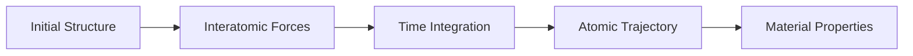
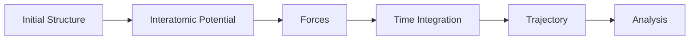
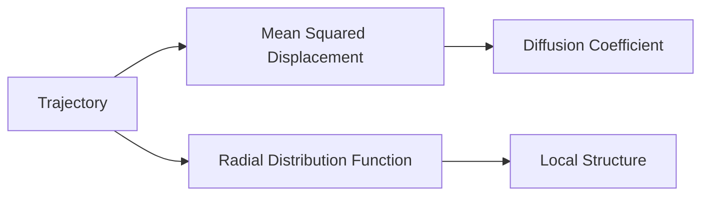
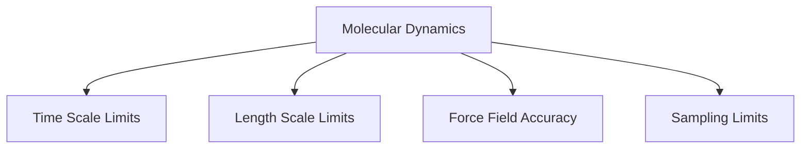

# Module 08 — Molecular Dynamics

> Learn how atomic motion is simulated and how trajectories become materials insight.

---

# Purpose

Molecular Dynamics simulates the motion of atoms over time.

It connects interatomic forces, statistical mechanics, and material behavior.

The goal of this module is not to master every MD engine.

The goal is to understand what MD can answer, what it cannot answer, and how to interpret trajectories scientifically.

---

# Why This Module Exists

DFT predicts electronic energies and forces.

MD uses forces to simulate atomic motion.

MD is used to study:

- diffusion
- defects
- phase transformations
- thermal behavior
- mechanical response
- liquids and amorphous systems
- atomistic mechanisms

---

# Guiding Question

> What can we learn by watching atoms move?

---

# Big Picture

---

# Learning Outcomes

After completing this module you should be able to:

- explain what Molecular Dynamics simulates
- distinguish forces, potentials, and trajectories
- explain the role of time integration
- understand ensembles conceptually
- distinguish classical MD from ab initio MD
- explain diffusion from trajectories
- understand limitations of time scale and length scale
- inspect and interpret simple MD outputs

---

# Prerequisites

- Module 04 — Statistical Mechanics
- Module 05 — Crystallography
- Module 07 — Density Functional Theory

---

# Scope

Included:

- Newtonian dynamics
- interatomic potentials
- force fields
- time integration
- trajectories
- ensembles
- temperature control
- diffusion
- radial distribution functions
- LAMMPS awareness

Excluded:

- advanced enhanced sampling
- reactive force fields in depth
- ab initio MD in depth
- GPU optimization
- production-scale MD workflows

---

# Canonical Resources

## Primary

Frenkel & Smit

**Understanding Molecular Simulation**

Use selectively.

## Reference

Allen & Tildesley

**Computer Simulation of Liquids**

Use as reference.

## Software

- LAMMPS
- ASE
- OVITO
- MDAnalysis

---

# Weekly Plan

## Week 1 — Forces and Motion

Study:

- Newton's laws
- interatomic potentials
- trajectories

Artifact:

`01-forces-and-trajectories.md`

## Week 2 — Time Integration and Ensembles

Study:

- timestep
- energy conservation
- NVE
- NVT
- NPT

Artifact:

`02-ensembles.md`

## Week 3 — Analyzing Trajectories

Study:

- diffusion
- mean squared displacement
- radial distribution function

Artifact:

`03-trajectory-analysis.ipynb`

## Week 4 — MD as Materials Research

Study:

- MD limitations
- timescale problem
- force-field validity
- connection to ML potentials

Artifact:

`04-md-limitations.md`

---

# Mental Models

## MD Workflow

## From Trajectory to Property

## MD Limitations

---

# Practical Work

## Notebook 01 — Toy MD

Implement a simple one-dimensional particle simulation.

## Notebook 02 — Random Walk vs MD

Compare random walk diffusion with trajectory-based diffusion.

## Notebook 03 — Trajectory Analysis

Analyze a simple trajectory dataset.

---

# Mini Project

## Molecular Dynamics Primer

Create:

`molecular-dynamics-primer.md`

Explain:

- what MD simulates
- how forces generate motion
- what trajectories contain
- how properties are extracted
- where MD fails

Use Mermaid diagrams and simple code examples.

---

# Mastery Gates

Proceed only if you can:

- explain the MD workflow
- distinguish potential, force, and trajectory
- explain basic ensembles
- interpret simple trajectory outputs
- explain MD limitations clearly

---

# Relationships

## Supports Roadmap

- Module 10 — Phase-Field Methods
- Module 11 — Materials Informatics
- Module 12 — Machine Learning for Materials

## Related Domains

- Molecular Dynamics
- Statistical Mechanics
- Atomistic Simulation
- Machine Learning Potentials

## Primary Resources

- Frenkel & Smit
- LAMMPS
- ASE
- OVITO

---

# Estimated Duration

4 weeks

10–15 hours per week.

---

# Continue With

**Module 09 — CALPHAD**

