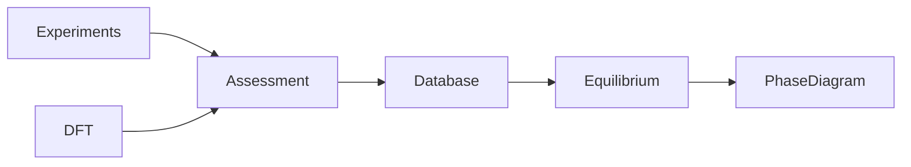
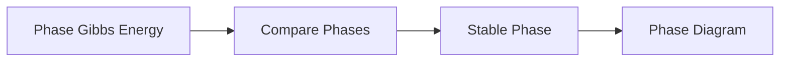
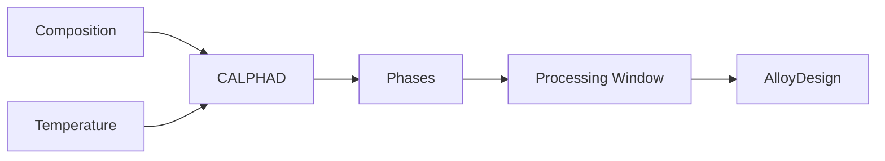

# Module 09 — CALPHAD

> Learn computational thermodynamics for phase equilibria and materials design.

---

# Purpose

CALPHAD models phase stability using thermodynamic descriptions of phases.

It is one of the most important bridges between classical metallurgy and modern computational materials engineering.

The goal is not to become a CALPHAD database developer.

The goal is to understand how phase diagrams are computed and why thermodynamic databases matter.

---

# Why This Module Exists

Phase diagrams are not just textbook figures.

They can be calculated.

CALPHAD is used to design alloys, predict phase stability, and support industrial materials development.

For someone with a metallurgy background, CALPHAD is one of the most valuable computational methods to understand.

---

# Guiding Question

> How are phase diagrams computed from thermodynamic models?

---

# Big Picture

---

# Learning Outcomes

After completing this module you should be able to:

- explain what CALPHAD is
- explain why thermodynamic databases are needed
- understand Gibbs energy models for phases conceptually
- interpret calculated phase diagrams
- distinguish experimental, DFT, and assessed thermodynamic data
- understand where Thermo-Calc and pycalphad fit
- explain how CALPHAD connects to alloy design

---

# Prerequisites

- Module 03 — Thermodynamics
- Module 04 — Statistical Mechanics
- Module 05 — Crystallography

---

# Scope

Included:

- phase equilibrium
- Gibbs energy models
- thermodynamic databases
- binary and ternary phase diagrams
- assessed data
- pycalphad awareness
- Thermo-Calc awareness

Excluded:

- full database assessment
- advanced multicomponent alloy design
- kinetic simulations
- precipitation modeling in depth

---

# Canonical Resources

## Primary

Saunders & Miodownik

**CALPHAD: Calculation of Phase Diagrams**

## Software

- Thermo-Calc
- pycalphad

---

# Weekly Plan

## Week 1 — What CALPHAD Is

Study:

- phase diagrams as calculated objects
- Gibbs energy of phases
- equilibrium calculation

Artifact:

`01-what-is-calphad.md`

## Week 2 — Thermodynamic Databases

Study:

- assessed data
- experimental input
- DFT input
- database limitations

Artifact:

`02-thermodynamic-databases.md`

## Week 3 — Binary and Ternary Systems

Study:

- binary phase diagrams
- ternary diagrams
- equilibrium regions

Artifact:

`03-phase-diagram-interpretation.ipynb`

## Week 4 — Practical CALPHAD

Study:

- pycalphad examples
- Thermo-Calc concepts

Artifact:

`04-calphad-workflow.md`

---

# Mental Models

## CALPHAD Workflow

## Phase Stability

## CALPHAD in Materials Design

---

# Practical Work

## Notebook 01 — Binary Phase Diagram

Use sample data to plot a simplified binary phase diagram.

## Notebook 02 — Gibbs Energy Curves

Visualize phase stability using schematic Gibbs energy curves.

## Notebook 03 — pycalphad Exploration

Run a minimal pycalphad example if available.

---

# Mini Project

## CALPHAD Primer

Create:

`calphad-primer.md`

Explain:

- why phase diagrams can be calculated
- what thermodynamic databases contain
- how Gibbs energy models drive equilibrium calculations
- how CALPHAD supports alloy design

---

# Mastery Gates

Proceed only if you can:

- explain CALPHAD conceptually
- interpret calculated binary phase diagrams
- explain the role of thermodynamic databases
- distinguish CALPHAD from DFT
- explain why CALPHAD matters for alloy design

---

# Relationships

## Supports Roadmap

- Module 10 — Phase-Field Methods
- Module 11 — Materials Informatics
- Module 15 — Capstone Research Project

## Related Domains

- CALPHAD
- Thermodynamics
- Phase Diagrams
- Alloy Design

## Primary Resources

- Saunders & Miodownik
- pycalphad
- Thermo-Calc

---

# Estimated Duration

3–4 weeks

10–15 hours per week.

---

# Continue With

**Module 10 — Phase-Field Methods**

