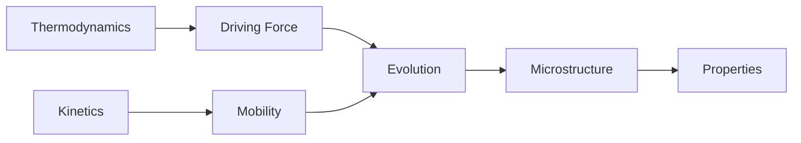
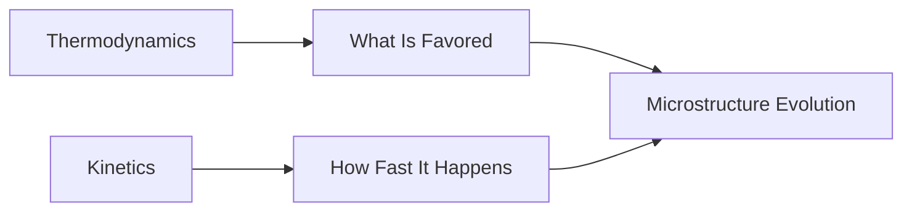
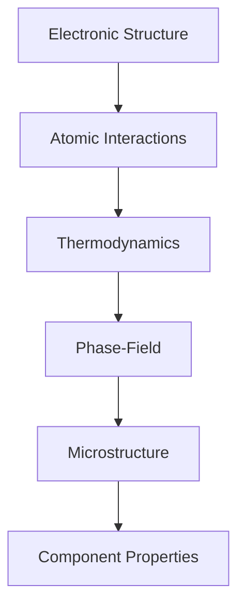

# Module 10 — Phase-Field Methods

> Learn how microstructure evolution is modeled computationally.

---

# Purpose

Phase-field methods model how microstructures evolve over time.

This module connects:

- thermodynamics
- kinetics
- diffusion
- interfaces
- microstructure
- numerical simulation

The goal is not to derive every phase-field equation.

The goal is to understand why phase-field modeling exists and how it fits into Computational Materials Science.

---

# Why This Module Exists

Materials properties depend strongly on microstructure.

Microstructures evolve during:

- solidification
- heat treatment
- precipitation
- grain growth
- phase separation
- coarsening

Phase-field methods provide a computational way to simulate that evolution.

---

# Guiding Question

> How can we simulate the evolution of microstructure?

---

# Big Picture



---

# Learning Outcomes

After completing this module, you should be able to:

- explain why phase-field modeling is used
- distinguish sharp interfaces from diffuse interfaces
- explain the role of order parameters
- connect free energy to microstructure evolution
- distinguish thermodynamics from kinetics
- understand Cahn-Hilliard and Allen-Cahn equations conceptually
- explain how CALPHAD can support phase-field simulations

---

# Prerequisites

- Module 03 — Thermodynamics
- Module 04 — Statistical Mechanics
- Module 08 — Molecular Dynamics
- Module 09 — CALPHAD

---

# Scope

Included:

- order parameters
- diffuse interfaces
- free energy functionals
- microstructure evolution
- Cahn-Hilliard intuition
- Allen-Cahn intuition
- grain growth
- phase separation

Excluded:

- rigorous variational calculus
- advanced numerical solvers
- production phase-field frameworks in depth

---

# Canonical Resources

## Primary

Provatas and Elder

**Phase-Field Methods in Materials Science and Engineering**

Use conceptually.

---

## Software Awareness

- FiPy
- MOOSE
- PRISMS-PF

The goal is awareness, not mastery.

---

# Weekly Plan

## Week 1 - Why Phase-Field?

Study:

- microstructure evolution
- interfaces
- order parameters
- diffuse interface idea

Artifact:

```text
01-why-phase-field.md
```

---

## Week 2 - Free Energy and Evolution

Study:

- free energy landscape
- driving force
- mobility
- stable and metastable states

Artifact:

```text
02-free-energy-and-evolution.ipynb
```

---

## Week 3 - Cahn-Hilliard and Allen-Cahn

Study conceptually:

- conserved order parameters
- non-conserved order parameters
- phase separation
- grain growth

Artifact:

```text
03-evolution-equations.md
```

---

## Week 4 - Simple Simulation

Build a toy phase-field visualization.

Artifact:

```text
04-phase-field-toy-model.ipynb
```

---

# Mental Models

## Phase-Field Workflow


---

## Thermodynamics and Kinetics



---

## Multiscale Context



---

# Practical Work

Create:

```text
01-free-energy-landscape.ipynb
02-order-parameter-visualization.ipynb
03-phase-separation-toy-model.ipynb
04-phase-field-summary.md
```

Prioritize visual intuition.

---

# Mini Project

## Phase-Field Primer

Create:

```text
phase-field-primer.md
```

Explain:

- why microstructure evolution matters
- what an order parameter is
- why diffuse interfaces are useful
- how free energy drives evolution
- how kinetics controls rate
- how phase-field connects to CALPHAD

Use Mermaid diagrams and concise explanations.

---

# Reflection Questions

- Why is microstructure evolution difficult to model directly?
- Why are diffuse interfaces useful?
- What is an order parameter?
- Why does free energy drive evolution?
- Why is kinetics necessary in addition to thermodynamics?
- How does phase-field complement CALPHAD?

---

# Mastery Gates

Proceed only if you can explain:

- what phase-field modeling is
- why order parameters are used
- the difference between thermodynamic driving force and kinetic mobility
- the conceptual difference between Cahn-Hilliard and Allen-Cahn
- how phase-field fits into multiscale modeling

without relying on equations.

---

# Relationships

## Supports Roadmap

- Module 11 — Materials Informatics
- Module 15 — Capstone Research Project

## Related Domains

- Phase-Field Modeling
- Microstructure Evolution
- CALPHAD
- Diffusion
- Multiscale Modeling

---

# Estimated Duration

4 weeks

10–15 hours per week.

Advance based on mastery rather than time.

---

# Continue With

**Module 11 — Materials Informatics**
