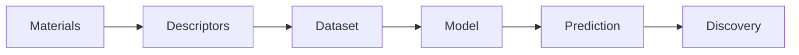
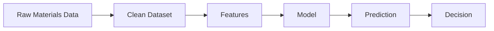
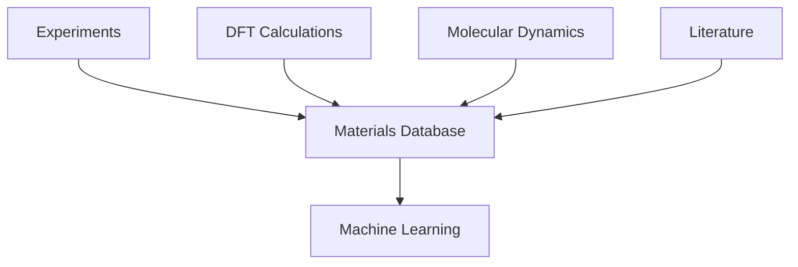
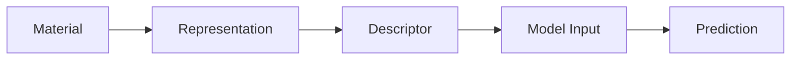

# Module 11 - Materials Informatics

> Learn how materials data becomes scientific insight and prediction.

---

# Purpose

Materials Informatics connects Materials Science with data science.

This module teaches how materials data is collected, represented, cleaned, analyzed, and used for prediction.

The goal is not to become a machine learning expert yet.

The goal is to understand how materials data becomes useful.

---

# Why This Module Exists

Modern materials research produces data from:

- experiments
- DFT calculations
- Molecular Dynamics
- CALPHAD
- high-throughput workflows
- literature
- public databases

Materials Informatics turns that data into searchable, comparable, and predictive knowledge.

---

# Guiding Question

> How can materials data be organized, represented, and used for prediction?

---

# Big Picture



---

# Learning Outcomes

After completing this module, you should be able to:

- explain what materials descriptors are
- distinguish composition-based and structure-based features
- query and interpret materials databases
- build simple property prediction datasets
- recognize data leakage and benchmark problems
- explain why materials data is difficult
- understand the role of matminer and pymatgen

---

# Prerequisites

- Module 02 - Scientific Python
- Module 05 - Crystallography & Crystal Structures
- Module 07 - Density Functional Theory

---

# Scope

Included:

- materials datasets
- descriptors
- featurization
- property prediction
- data leakage
- benchmarking
- Materials Project
- matminer
- pymatgen

Excluded:

- deep learning in depth
- graph neural networks in depth
- generative models
- autonomous laboratories

---

# Canonical Resources

## Documentation

- Materials Project documentation
- pymatgen documentation
- matminer documentation

---

## Papers

Use as orientation:

- Materials Project
- pymatgen
- matminer
- CGCNN

---

# Weekly Plan

## Week 1 - Materials Data

Study:

- materials databases
- property records
- structure records
- provenance

Artifact:

```text
01-materials-data.md
```

---

## Week 2 - Descriptors

Study:

- composition descriptors
- structure descriptors
- feature engineering

Artifact:

```text
02-descriptors.ipynb
```

---

## Week 3 - Property Prediction

Build a simple supervised learning baseline.

Artifact:

```text
03-property-prediction.ipynb
```

---

## Week 4 - Data Quality

Study:

- leakage
- uncertainty
- train/test splits
- benchmark design

Artifact:

```text
04-data-quality.md
```

---

# Mental Models

## Materials Informatics Pipeline



---

## Data Sources



---

## Descriptor Thinking



---

# Practical Work

Create:

```text
01-materials-project-query.ipynb
02-featurization.ipynb
03-baseline-model.ipynb
04-error-analysis.ipynb
```

---

# Mini Project

## Materials Property Predictor

Build a small property prediction project.

It should include:

- a dataset
- feature generation
- baseline model
- evaluation
- error analysis
- limitations

The goal is not high accuracy.

The goal is scientific honesty.

---

# Reflection Questions

- Why is materials data difficult?
- Why are descriptors necessary?
- What information is lost when reducing a structure to features?
- What makes a benchmark misleading?
- Why is provenance important?

---

# Mastery Gates

Proceed only if you can:

- explain composition and structure descriptors
- build a small materials dataset
- train and evaluate a baseline model
- identify possible leakage
- explain limitations honestly

---

# Relationships

## Supports Roadmap

- Module 12 - Machine Learning for Materials
- Module 13 - Research Infrastructure
- Module 15 - Capstone Research Project

## Related Domains

- Materials Informatics
- Materials Databases
- Scientific Data
- Machine Learning

---

# Estimated Duration

4 weeks

8-12 hours per week.

Advance based on mastery.

---

# Continue With

**Module 12 - Machine Learning for Materials**

