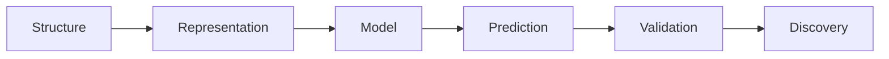
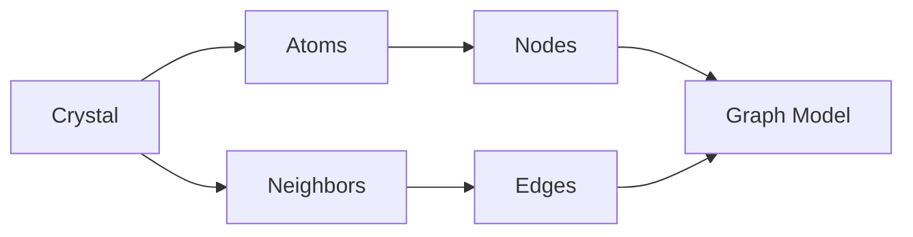
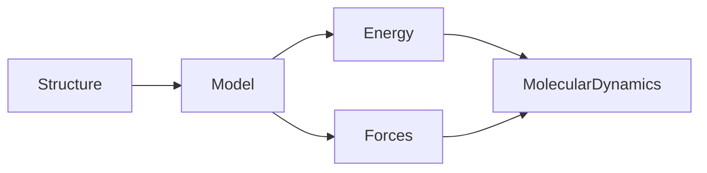
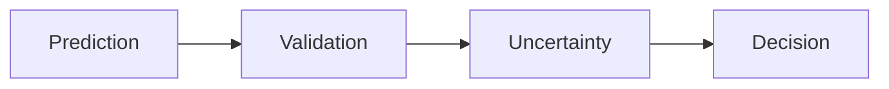

# Module 12 - Machine Learning for Materials

> Learn modern machine learning methods for materials prediction and discovery.

---

# Purpose

Machine Learning for Materials extends Materials Informatics into modern predictive modeling.

This module focuses on representations, validation, scientific interpretation, and trust.

The goal is not to chase model hype.

The goal is to understand what ML can predict, when it fails, and how to evaluate it scientifically.

---

# Why This Module Exists

Materials ML now influences:

- property prediction
- crystal graph learning
- learned interatomic potentials
- high-throughput screening
- generative materials design
- foundation-model research

To use these tools responsibly, you need both ML literacy and materials intuition.

---

# Guiding Question

> What can machine learning predict in materials science, and when should we trust it?

---

# Big Picture



---

# Learning Outcomes

After completing this module, you should be able to:

- distinguish classical ML from deep learning for materials
- explain why representation matters
- understand crystal graph neural networks conceptually
- explain learned interatomic potentials
- evaluate model claims critically
- understand uncertainty and validation
- use pretrained materials models cautiously

---

# Prerequisites

- Module 11 - Materials Informatics

---

# Scope

Included:

- supervised learning
- classical baselines
- graph neural networks
- crystal graph representations
- learned interatomic potentials
- transfer learning awareness
- uncertainty
- validation
- pretrained models

Excluded:

- training large foundation models
- advanced deep learning theory
- production ML infrastructure
- autonomous laboratory systems

---

# Canonical Papers

Use as orientation:

- CGCNN
- MEGNet
- M3GNet
- CHGNet
- MatterGen
- GNoME

Do not attempt to master every architecture immediately.

---

# Software Awareness

- PyTorch
- MatGL
- CHGNet
- pymatgen
- Materials Project

---

# Weekly Plan

## Week 1 - Baseline ML

Study:

- regression
- classification
- train/test splits
- metrics
- error analysis

Artifact:

```text
01-baseline-ml.ipynb
```

---

## Week 2 - Crystal Graphs

Study:

- structures as graphs
- atoms as nodes
- bonds or neighbors as edges
- graph neural networks conceptually

Artifact:

```text
02-crystal-graphs.md
```

---

## Week 3 - Learned Potentials

Study:

- force prediction
- energy prediction
- ML potentials
- relation to Molecular Dynamics

Artifact:

```text
03-learned-potentials.md
```

---

## Week 4 - Validation and Trust

Study:

- distribution shift
- uncertainty
- benchmark quality
- scientific claims

Artifact:

```text
04-validation-and-trust.md
```

---

# Mental Models

## Crystal Graph



---

## Learned Potential



---

## Trust Pipeline



---

# Practical Work

Create:

```text
01-classical-baseline.ipynb
02-crystal-graph-notes.md
03-pretrained-model-inference.ipynb
04-model-error-analysis.md
```

---

# Mini Project

## ML for Materials Baseline

Build a small reproducible ML project.

It should include:

- dataset
- representation
- baseline model
- model evaluation
- uncertainty or error discussion
- limitations

The goal is to show judgment, not leaderboard performance.

---

# Reflection Questions

- Why are crystal structures difficult for ordinary ML?
- What does a graph representation preserve?
- What does it lose?
- Why are learned potentials useful?
- What makes a materials ML benchmark trustworthy?
- When should an ML prediction not be trusted?

---

# Mastery Gates

Proceed only if you can:

- explain why representation matters
- describe a crystal graph model conceptually
- explain learned interatomic potentials
- build and evaluate a baseline model
- critique model claims scientifically

---

# Relationships

## Supports Roadmap

- Module 13 - Research Infrastructure
- Module 15 - Capstone Research Project

## Related Domains

- Machine Learning
- Materials Informatics
- Graph Neural Networks
- Learned Interatomic Potentials

---

# Estimated Duration

4 weeks

8-12 hours per week.

Advance based on mastery.

---

# Continue With

**Module 13 - Research Infrastructure**

