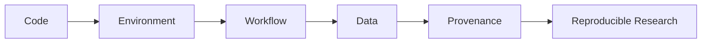
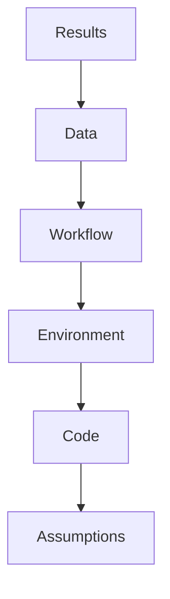
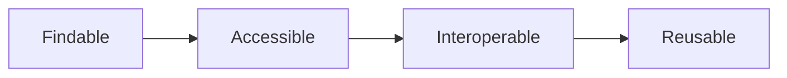
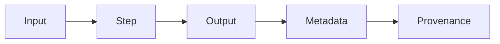

# Module 13 — Research Infrastructure

> Learn how reproducible computational materials research is organized, executed, and preserved.

---

# Purpose

Research infrastructure is the discipline of making computational research reproducible, inspectable, and reusable.

This module teaches the practices that turn notebooks and scripts into trustworthy scientific artifacts.

---

# Why This Module Exists

A calculation is not research by itself.

Computational research also needs:

- provenance
- version control
- environments
- workflow tracking
- data management
- validation
- documentation

Without infrastructure, results become difficult to reproduce and hard to trust.

---

# Guiding Question

> What makes computational research reproducible?

---

# Big Picture



---

# Learning Outcomes

After completing this module, you should be able to:

- organize a reproducible research project
- document computational provenance
- manage scientific environments
- explain FAIR data principles
- distinguish notebooks from research artifacts
- understand workflow engines conceptually
- prepare a project another researcher can run

---

# Prerequisites

- Module 02 — Scientific Computing with Python
- Module 11 — Materials Informatics
- Module 12 — Machine Learning for Materials

---

# Scope

Included:

- Git for research
- environment management
- project structure
- provenance
- FAIR data
- workflow systems
- notebooks
- HPC awareness
- reproducibility

Excluded:

- enterprise DevOps
- Kubernetes
- production MLOps
- cloud architecture in depth

---

# Tools and Systems

Use as awareness:

- Git
- Jupyter
- conda
- uv
- pip
- AiiDA
- atomate2
- jobflow
- Materials Cloud

---

# Weekly Plan

## Week 1 — Reproducible Structure

Study:

- project layout
- README design
- environments
- data folders

Artifact:

```text
01-research-project-structure.md
```

---

## Week 2 - Provenance and FAIR

Study:

- provenance
- metadata
- FAIR principles
- reproducible records

Artifact:

```text
02-provenance-and-fair.md
```

---

## Week 3 - Workflows

Study:

- workflow engines
- job tracking
- failure handling
- reproducibility

Artifact:

```text
03-workflows.md
```

---

## Week 4 - Packaging Research

Study:

- documentation
- scripts vs notebooks
- figures
- result summaries
- limitations

Artifact:

```text
04-research-package.md
```

---

# Mental Models

## Reproducibility Stack



---

## FAIR Data



---

## Workflow Provenance



---

# Practical Work

Create:

```text
01-reproducible-notebook.ipynb
02-research-readme.md
03-workflow-map.md
04-reproducibility-checklist.md
```

---

# Mini Project

## Reproducible Research Package

Take one earlier notebook project and convert it into a reproducible research package.

It should include:

- README
- environment file
- data description
- runnable notebook or script
- figures
- results summary
- limitations

---

# Reflection Questions

- What makes a result reproducible?
- What information is needed to rerun a calculation?
- Why is provenance scientific evidence?
- When should a notebook become a script?
- What should be preserved and what should be deleted?

---

# Mastery Gates

Proceed only if you can:

- structure a reproducible research project
- document assumptions and provenance
- explain FAIR principles
- package a computational result clearly
- make another person able to rerun your work

---

# Relationships

## Supports Roadmap

- Module 14 — Scientific Software Engineering
- Module 15 — Capstone Research Project

## Related Domains

- Reproducible Research
- Scientific Workflows
- Research Data Management
- Computational Infrastructure

---

# Estimated Duration

3 weeks

8–10 hours per week.

Advance based on mastery.

---

# Continue With

**Module 14 — Scientific Software Engineering**
