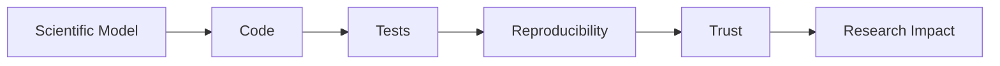
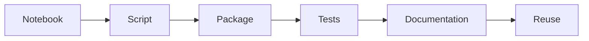
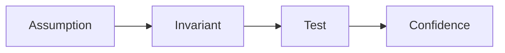
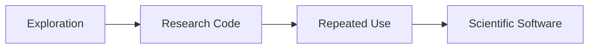

# Module 14 — Scientific Software Engineering

> Build scientific software that is reliable, understandable, and useful to researchers.

---

# Purpose

Scientific Software Engineering applies professional software engineering judgment to scientific computing.

This module focuses on building software that supports research without overengineering it.

---

# Why This Module Exists

Scientific software has different constraints from product software.

It must be:

- correct
- reproducible
- transparent
- inspectable
- usable by researchers
- honest about assumptions

The goal is not to turn every notebook into an enterprise system.

The goal is to know when research code should become software.

---

# Guiding Question

> What makes scientific software trustworthy?

---

# Big Picture



---

# Learning Outcomes

After completing this module, you should be able to:

- distinguish research code from scientific software
- design small scientific APIs
- test numerical code
- document assumptions
- review scientific code critically
- prepare open-source contributions
- avoid overengineering scientific workflows

---

# Prerequisites

- Module 13 — Research Infrastructure

---

# Scope

Included:

- API design for scientific tools
- numerical testing
- documentation
- reproducibility
- packaging
- open-source contribution
- code review
- maintainability

Excluded:

- SaaS architecture
- enterprise distributed systems
- frontend application design
- large-scale platform engineering

---

# Canonical Codebases

Read selectively:

- pymatgen
- ASE
- atomate2
- AiiDA
- MatGL

Focus on design choices, not line-by-line comprehension.

---

# Weekly Plan

## Week 1 — Reading Scientific Code

Study one mature scientific Python library.

Artifact:

```text
01-codebase-reading-notes.md
```

---

## Week 2 - Testing Numerical Code

Study:

- tolerances
- invariants
- regression tests
- reference values

Artifact:

```text
02-numerical-tests.ipynb
```

---

## Week 3 - API Design

Study:

- small APIs
- data models
- scientific assumptions
- error handling

Artifact:

```text
03-scientific-api-design.md
```

---

## Week 4 - Open Source Contribution

Prepare a small contribution plan.

Artifact:

```text
04-open-source-contribution-plan.md
```

---

# Mental Models

## Scientific Software Lifecycle



---

## Testing Scientific Code



---

## Research Code vs Software



---

# Practical Work

Create:

```text
01-library-design-review.md
02-numerical-testing-examples.ipynb
03-refactored-research-code/
04-open-source-issue-analysis.md
```

---

# Mini Project

## Scientific Utility Package

Turn one previous notebook helper into a small reusable package.

It should include:

- minimal API
- tests
- documentation
- examples
- limitations

The package should be boring, clear, and useful.

---

# Reflection Questions

- When should research code remain a notebook?
- What makes a scientific API good?
- How should numerical tests be designed?
- What assumptions should be documented?
- What does overengineering look like in scientific software?

---

# Mastery Gates

Proceed only if you can:

- review a scientific codebase
- write meaningful numerical tests
- design a small scientific API
- document scientific assumptions
- prepare a credible open-source contribution

---

# Relationships

## Supports Roadmap

- Module 15 — Capstone Research Project

## Related Domains

- Scientific Software
- Research Infrastructure
- Open Source
- Reproducible Computing

---

# Estimated Duration

4 weeks

8–12 hours per week.

Advance based on mastery.

---

# Continue With

**Module 15 — Capstone Research Project**
