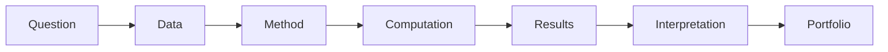
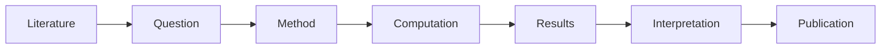
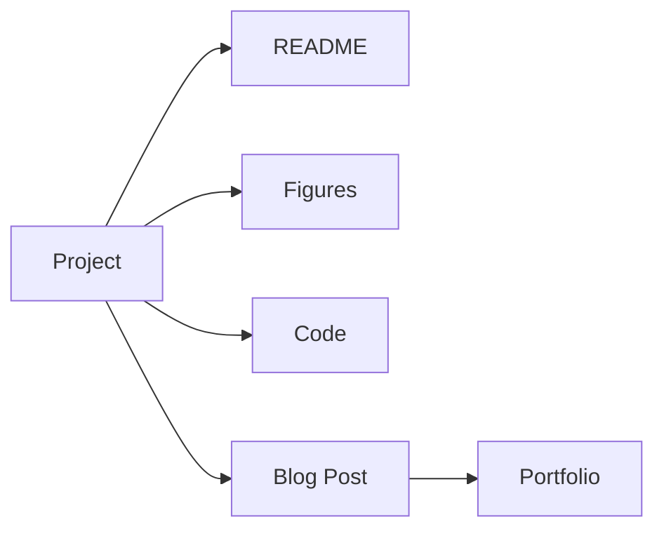

# Module 15 - Capstone Research Project

> Integrate the curriculum into one end-to-end computational materials project.

---

# Purpose

The capstone project turns learning into evidence.

This module asks you to define a research question, choose appropriate methods, produce reproducible artifacts, interpret results, and publish the work as a portfolio-quality project.

---

# Why This Module Exists

A roadmap is not complete until it produces work.

The capstone demonstrates that you can combine:

- materials intuition
- scientific computing
- thermodynamics
- atomistic simulation
- data analysis
- machine learning
- reproducible research
- scientific software engineering

---

# Guiding Question

> Can I produce a computational materials artifact another researcher could understand, run, and evaluate?

---

# Big Picture



---

# Capstone Options

Choose one.

## Option 1 - Reproduce a Paper

Reproduce a limited result from a computational materials paper.

Good for:

- scientific rigor
- literature practice
- reproducibility

---

## Option 2 - Materials Informatics Project

Build a dataset, train a model, and evaluate it honestly.

Good for:

- AI for Materials
- portfolio value
- software demonstration

---

## Option 3 - DFT Data Analysis

Use existing DFT data to analyze stability, structure, or properties.

Good for:

- Materials Project workflows
- phase stability
- electronic structure intuition

---

## Option 4 - Scientific Software Contribution

Contribute a small improvement to an open-source scientific Python project.

Good for:

- credibility
- real ecosystem participation
- engineering signal

---

# Required Project Structure

```text
capstone/
  README.md
  environment.md
  data/
  notebooks/
  src/
  figures/
  results/
  limitations.md
```

---

# Required Deliverables

Your final project must include:

- research question
- motivation
- background
- data or input description
- method
- reproducible environment
- results
- interpretation
- limitations
- next steps
- portfolio summary

---

# Evaluation Criteria

## Scientific Clarity

Can another person understand the question and why it matters?

---

## Reproducibility

Can another person rerun the work?

---

## Technical Quality

Is the code understandable, tested where appropriate, and documented?

---

## Materials Relevance

Does the project answer a meaningful materials science question?

---

## Honesty

Are limitations clearly stated?

---

# Suggested Themes

- band gap prediction
- formation energy analysis
- phase stability exploration
- alloy property prediction
- battery cathode screening
- learned potential comparison
- Materials Project data explorer
- crystal structure visualization
- scientific software contribution

---

# Research Workflow



---

# Portfolio Workflow



---

# Weekly Plan

## Week 1 - Project Definition

Define:

- question
- scope
- data
- method
- success criteria

Artifact:

```text
project-proposal.md
```

---

## Weeks 2-3 - Implementation

Build the core analysis or software artifact.

Artifact:

```text
notebooks/
src/
```

---

## Week 4 - Validation

Check:

- reproducibility
- assumptions
- results
- limitations

Artifact:

```text
limitations.md
```

---

## Week 5 - Packaging

Prepare:

- README
- figures
- environment
- summary

Artifact:

```text
README.md
```

---

## Week 6 - Publication

Publish:

- GitHub repository
- technical blog post
- portfolio entry

Artifact:

```text
portfolio-summary.md
```

---

# Mastery Gates

You have completed the roadmap if you can:

- define a credible research question
- choose methods intentionally
- explain limitations honestly
- make the work reproducible
- communicate the result clearly
- connect the project to future research or career goals

---

# Final Reflection

Answer:

- What did I learn about Computational Materials Science?
- What did I learn about my own strengths?
- Which area deserves deeper study?
- Which project should I build next?
- What is the next research question?

---

# Estimated Duration

6-10 weeks

Advance based on project quality, not time.

---

# Continue With

Build a second project or begin contributing to the scientific Python ecosystem.

